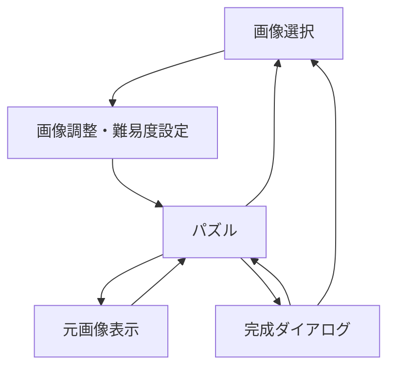

# App Slide Puzzle Lab 要件定義書

> [!NOTE]
> 本ドキュメントは初期版（v0.1）です。推奨案・確定事項を反映した最新版は [app-slide-puzzle-lab-requirements-v0.2.md](./app-slide-puzzle-lab-requirements-v0.2.md) を参照してください。

| 項目 | 内容 |
| --- | --- |
| 文書バージョン | 0.1 |
| 作成日 | 2026-09-23 |
| 対象 | MVP（初期リリース） |
| アプリ形態 | 完全ローカルで動作するWebアプリ／PWA |

## 1. 概要

### 1.1 目的

利用者が端末内の写真や画像を取り込み、複数のピースに分割されたスライドパズルとして、通信を必要とせずに楽しめるWebアプリを提供する。

### 1.2 背景

一般的なスライドパズルは、1マスを空白にした盤面上で、その空白に隣接するピースを移動し、分割された画像を元の1枚の絵に戻すゲームである。本アプリでは、利用者自身の画像を使用できることと、分割数およびシャッフルの度合いを個別に選べることを特徴とする。

### 1.3 基本方針

- 画像の選択、加工、パズル生成、プレイ、完成判定を端末内で完結させる。
- 選択した画像を外部サーバーへ送信しない。
- 初回の読み込み後は、オフラインでも利用できるPWAとする。
- スマートフォンでのタッチ操作を優先し、PCのマウス操作にも対応する。
- 生成する盤面は必ず完成可能とする。
- 難易度は「分割数」と「シャッフルの度合い」の2軸で設定できるようにする。

## 2. 対象範囲

### 2.1 MVPに含める機能

- 端末内の画像選択
- 画像の表示範囲調整
- 分割数の選択
- シャッフルの度合いの選択
- 完成可能な盤面の生成
- タップ、クリックまたはスワイプによるピース移動
- 手数および経過時間の計測
- 元画像の確認
- パズルのやり直しおよび再シャッフル
- 完成判定と完成結果の表示
- レスポンシブ対応
- PWAインストールおよびオフライン起動

### 2.2 MVPに含めない機能

- ユーザーアカウント
- サーバーへの画像またはプレイ記録の保存
- 複数端末間の同期
- ランキング、対戦、共有機能
- カメラの直接起動による撮影
- 複数画像のライブラリ管理
- ベストタイムおよび最少手数の永続保存
- 自動解答、高度なヒント、最短手数の算出
- ジグソーパズル形式
- 空白マスを使用しないピース入れ替え形式

## 3. 想定利用者と利用環境

### 3.1 想定利用者

- 手持ちの写真や絵を使って気軽にパズルを楽しみたい人
- ネットワーク接続やアカウント登録なしで利用したい人
- スマートフォン、タブレットまたはPCの一般利用者

### 3.2 対象環境

- スマートフォン、タブレット、PCのモダンブラウザ
- 最新版および主要な1世代前のChrome、Edge、Safari、Firefoxを基本対象とする
- iOS SafariおよびAndroid Chromeで主要機能を利用できること
- JavaScriptおよびブラウザストレージが有効であること

## 4. ユースケース

### UC-01 新しいパズルを作成する

1. 利用者が端末内の画像を選択する。
2. アプリが画像をブラウザ内で読み込む。
3. 利用者が画像の表示範囲を調整する。
4. 利用者が分割数とシャッフルの度合いを選択する。
5. 利用者がパズルを開始する。
6. アプリが完成可能な盤面を生成して表示する。

### UC-02 パズルをプレイする

1. 利用者が空白マスに隣接するピースを操作する。
2. アプリがピースを空白マスへ移動する。
3. アプリが手数と経過時間を更新する。
4. 完成するまで操作を繰り返す。

### UC-03 元画像を確認する

1. 利用者が「元画像」操作を選択する。
2. アプリが元画像を一時的に表示する。
3. 利用者が表示を閉じると、現在の盤面へ戻る。
4. 元画像の確認は手数に加算しない。

### UC-04 パズルをやり直す

- 「最初から」を選択した場合、現在と同じ初期配置へ戻す。
- 「再シャッフル」を選択した場合、現在の設定を維持して別の盤面を生成する。
- 進行中に実行する場合は、誤操作防止のため確認を求める。

### UC-05 パズルを完成する

1. アプリが各ピースの位置を完成状態と照合する。
2. 完成時にタイマーを停止する。
3. 空白マスを含む完成画像を表示する。
4. 経過時間と手数を完成ダイアログに表示する。
5. 利用者は同じ設定で再挑戦するか、新しい画像を選択できる。

## 5. 画面構成

| 画面・表示 | 主な内容 |
| --- | --- |
| 画像選択画面 | アプリ概要、画像選択、ローカル処理の案内 |
| パズル設定画面 | 画像プレビュー、表示範囲調整、分割数、シャッフルの度合い、開始ボタン |
| パズル画面 | 盤面、手数、経過時間、元画像、最初から、再シャッフル、新しい画像 |
| 元画像表示 | 調整後の完成画像を大きく確認できるモーダル表示 |
| 完成ダイアログ | 完成画像、手数、経過時間、再挑戦、新しい画像 |
| オフライン／エラー表示 | 起動失敗、画像読込失敗、非対応形式などの案内 |

## 6. 機能要件

### FR-01 画像選択

- 利用者は端末内の画像ファイルを1件選択できる。
- 対応形式はJPEG、PNG、WebPを必須とする。
- HEICなどブラウザの対応状況が一定でない形式はMVPの保証対象外とする。
- 画像を選択するまでパズル開始操作を無効とする。
- 読み込めないファイル、画像ではないファイル、破損ファイルの場合は、原因と再選択方法を表示する。
- 過大な画像は、処理負荷とメモリ使用量を抑えるためブラウザ内で縮小して扱う。
- 選択した画像は外部へ送信せず、MVPでは永続保存しない。

### FR-02 画像の表示範囲調整

- パズル盤面は正方形を基本とする。
- 利用者は画像の拡大・縮小および表示位置の移動により、正方形の切り抜き範囲を調整できる。
- 初期表示では、画像中央を基準に正方形へ自動調整する。
- 設定画面のプレビューと、実際のパズルに使用する画像範囲を一致させる。
- 元画像の縦横比を維持し、歪ませない。

### FR-03 難易度設定

難易度は、以下の2項目を独立して設定できるものとする。

#### FR-03-1 分割数

| 選択肢 | 総マス数 | ピース数 |
| --- | ---: | ---: |
| 3×3 | 9 | 8 |
| 4×4 | 16 | 15 |
| 5×5 | 25 | 24 |
| 6×6 | 36 | 35 |

- 初期値は4×4とする。
- 分割数が多いほどピースを小さくし、盤面内に収める。
- 選択肢には「3×3」などの値を明示し、初級・中級・上級だけの表現にはしない。

#### FR-03-2 シャッフルの度合い

| 選択肢 | 説明 | 合法手数の基準 |
| --- | --- | ---: |
| 軽め | 完成状態に近く、短時間で遊びやすい | 総マス数 × 3 |
| 標準 | 適度に混ざった配置 | 総マス数 × 10 |
| 強め | 十分に混ざった配置 | 総マス数 × 30 |

- 初期値は「標準」とする。
- 表示上は名称と短い説明を併記する。
- 合法手数の基準はMVPの初期値とし、プレイテスト結果に応じて調整可能な実装とする。
- 同じ分割数でも、シャッフルの度合いによって完成状態からの崩れ方を変える。

### FR-04 盤面生成とシャッフル

- 完成状態から、空白マスを使った合法的な移動を指定回数行って盤面を生成する。
- これにより、生成される盤面が必ず完成可能であることを保証する。
- 原則として、直前の移動をそのまま取り消す手を次の候補から除外する。
- 合法手が1つしかない場合など、除外により候補がなくなる場合は直前位置への移動を許可する。
- シャッフル終了時に完成状態であった場合は、完成状態以外になるまで再度シャッフルする。
- 同一設定でも、乱数により異なる盤面を生成する。
- シャッフル処理中の移動は画面上で再生せず、手数および経過時間に加算しない。
- 盤面表示の完了後に計測を開始する。

### FR-05 ピース操作

- 空白マスに上下左右で隣接するピースだけを移動可能とする。
- スマートフォンおよびタブレットでは、隣接ピースのタップと空白方向へのスワイプに対応する。
- PCでは、隣接ピースのクリックに対応する。
- キーボード操作では、矢印キーにより空白マスまたは隣接ピースを移動できるようにする。移動方向の規則を画面上の説明と一致させる。
- 移動できないピースへの操作は盤面を変更せず、手数にも加算しない。
- 有効なピース移動1回を1手として加算する。
- 1回の入力で複数ピースをまとめて移動する機能はMVP対象外とする。
- ピース移動には短いアニメーションを付け、操作不能になるほど長くしない。
- アニメーション中の連続入力により盤面状態が不整合にならないよう制御する。

### FR-06 手数と経過時間

- パズル画面に現在の手数と経過時間を常時表示する。
- 経過時間は盤面の表示完了後に開始する。
- 完成時に計測を停止する。
- 元画像の表示中もタイマーは継続する。
- ブラウザのタブがバックグラウンドになった場合も、開始時刻との差分から正しい経過時間を算出する。
- 表示精度は1秒単位とする。

### FR-07 元画像の確認

- プレイ中に調整後の完成画像を確認できる。
- 元画像は盤面に重ねず、モーダルなど現在の盤面を誤操作しない方式で表示する。
- 元画像表示中はピースを操作できない。
- 元画像の確認回数はMVPでは制限しない。

### FR-08 やり直しと再シャッフル

- 「最初から」により、現在のパズル開始時の配置、手数0、経過時間0へ戻せる。
- 「再シャッフル」により、画像、表示範囲、分割数、シャッフルの度合いを維持し、新しい初期配置を生成できる。
- 「新しい画像」により画像選択画面へ戻れる。
- 進行中の記録が失われる操作には確認ダイアログを表示する。

### FR-09 完成判定

- 各ピースが正しい位置にあり、空白マスが規定位置にある場合に完成と判定する。
- 完成判定は有効なピース移動の直後に行う。
- 完成時は空白部分にも対応する画像領域を表示し、1枚の完成画像として確認できるようにする。
- 完成ダイアログに手数と経過時間を表示する。
- 完成後に盤面へ戻って追加操作できないようにする。

### FR-10 PWA・オフライン対応

- Web App Manifestを備え、対応ブラウザでホーム画面へインストールできるようにする。
- Service Workerにより、アプリ本体の静的リソースをキャッシュする。
- 少なくとも一度オンラインで正常に読み込んだ後は、オフラインでも起動して主要機能を利用できるようにする。
- 選択画像の処理およびパズル生成は、オンライン接続の有無に依存しない。
- 更新版が利用可能な場合は、プレイを妨げないタイミングで更新できるようにする。

### FR-11 設定保持

- 最後に選択した分割数とシャッフルの度合いは、ブラウザ内に保存して次回起動時の初期値として利用してよい。
- 選択画像および切り抜き後の画像はMVPでは保存しない。
- 保存データを削除した場合も、初期値で問題なく起動できること。

## 7. 非機能要件

### NFR-01 プライバシー

- 選択画像をネットワーク送信しない。
- アプリの主要機能にサーバーAPIを使用しない。
- アクセス解析や外部リソースを導入する場合も、画像データ、ファイル名、パズル内容を送信しない。
- ローカル処理であることを画像選択画面に明示する。

### NFR-02 性能

- 一般的なスマートフォンで、画像選択から設定画面の表示までを通常3秒以内の目標とする。
- パズル開始操作から盤面表示までを通常1秒以内の目標とする。
- ピース操作に対する画面反映は、体感上の遅延が目立たないこと。
- 高解像度画像は、パズル表示に必要な解像度を考慮して縮小し、メモリ使用量を抑える。

### NFR-03 ユーザビリティ

- 主要操作は片手でも押しやすいサイズと間隔を確保する。
- 盤面は可能な限り大きく表示し、画面幅を超えないようにする。
- 現在選択中の分割数とシャッフルの度合いを明確に識別できるようにする。
- 専門用語を避け、「端末内だけで処理されます」など一般利用者に分かる表現を使用する。
- 破壊的または進行を失う操作は、他の主要操作と視覚的に区別する。

### NFR-04 アクセシビリティ

- 操作要素に適切なラベルを付ける。
- キーボードだけでも主要操作を完了できるようにする。
- フォーカス位置を視覚的に確認できるようにする。
- 色だけに依存して状態を表現しない。
- 文字と背景は十分なコントラストを確保する。
- `prefers-reduced-motion`が指定されている場合、移動アニメーションを抑制する。

### NFR-05 信頼性

- 盤面状態、手数、表示上のピース位置が常に一致すること。
- 高速な連続操作、画面回転、タブの一時停止後も盤面が破損しないこと。
- エラー発生時は、再読み込みまたは画像の再選択で復旧できること。

### NFR-06 セキュリティ

- 選択ファイルを実行可能コンテンツとして扱わない。
- 画像のデコードに失敗した場合は安全に処理を中止する。
- 不要な外部通信、外部スクリプトおよび外部フォントへの依存を避ける。

### NFR-07 保守性

- 分割数、シャッフル倍率、対応画像形式などの設定値を一元管理する。
- 盤面ロジックとUI表示を分離する。
- シャッフル、ピース移動、完成判定はUIに依存しない単体テストが可能な構造とする。

## 8. データ要件

### 8.1 一時データ

- 選択画像
- 調整後の画像データ
- 各ピースの正解位置と現在位置
- 空白マスの位置
- 初期配置
- 現在の手数
- 開始時刻および経過時間
- プレイ状態（未開始、プレイ中、完成）

これらは原則としてメモリ上で管理し、ページを閉じた後の復元はMVP対象外とする。

### 8.2 永続データ

- 最後に選択した分割数
- 最後に選択したシャッフルの度合い
- 必要に応じて、PWA更新に関する最小限の状態

永続データはブラウザ内にのみ保存する。

## 9. 画面遷移

- 完成ダイアログからパズル画面へ戻る場合は、同じ設定で新しい盤面を生成する。
- 未完成状態で画像選択画面へ戻る場合は、確認を求める。

## 10. シャッフル仕様の補足

### 10.1 基本アルゴリズム

1. 完成状態の盤面を生成する。
2. 空白マスに隣接する移動可能ピースを列挙する。
3. 直前に移動したピースを戻す候補を原則として除外する。
4. 残った候補からランダムに1つ選択して移動する。
5. 選択されたシャッフルの度合いに対応する回数まで、2～4を繰り返す。
6. 完成状態でないことを確認する。
7. 盤面を初期配置として保持し、手数0でプレイを開始する。

### 10.2 難易度上の留意事項

- 合法手の回数は、完成までの最短手数と一致しない。
- 盤面内を循環することで、指定回数に対して実際の崩れ方が小さくなる可能性がある。
- MVPでは実装の確実性、処理速度、完成可能性を優先し、合法手数を難易度の近似値として使用する。
- 利用実績やプレイテストにより、倍率または候補選択方式を調整する。
- 将来、高精度な難易度が必要になった場合は、推定最短手数や盤面評価値による選別を検討する。

## 11. エラー処理

| 状況 | アプリの対応 |
| --- | --- |
| 非対応形式を選択 | 対応形式を案内し、再選択できるようにする |
| 画像の読込失敗 | 読み込めなかったことを表示し、再選択を促す |
| 画像が大きすぎる | ブラウザ内で縮小する。処理不能な場合は別画像を案内する |
| メモリ不足・描画失敗 | 処理を中止し、画像の再選択または小さい画像の利用を案内する |
| オフライン初回起動 | 初回読み込みには通信が必要であることを表示する |
| Service Worker更新失敗 | 現在利用可能な版で継続し、次回起動時に再試行する |

## 12. 受入条件

### AC-01 ローカル画像処理

- JPEG、PNG、WebPを選択し、外部へ画像データを送信せずにパズルを開始できる。
- ページを閉じた後、選択画像がアプリデータとして残らない。

### AC-02 難易度設定

- 3×3、4×4、5×5、6×6を選択でき、選択どおりの盤面が生成される。
- 軽め、標準、強めを選択でき、設定に対応した合法手数でシャッフルされる。
- 分割数とシャッフルの度合いを任意に組み合わせられる。

### AC-03 完成可能性

- すべての生成盤面が、完成状態から合法手だけで作られる。
- シャッフル直後に完成状態の盤面が表示されない。
- 直前の手を戻す移動が、他に候補がある場合は選ばれない。

### AC-04 パズル操作

- 空白マスに隣接するピースだけが移動する。
- タップまたはクリックで操作できる。
- 対応するタッチ端末ではスワイプ操作ができる。
- 無効操作は手数に加算されない。

### AC-05 計測と完成

- 有効な移動ごとに手数が1増える。
- 経過時間が1秒単位で表示され、完成時に停止する。
- 正しい盤面になった直後に完成が判定される。
- 完成時に完成画像、手数、経過時間が表示される。

### AC-06 再実行

- 「最初から」で同じ初期配置に戻る。
- 「再シャッフル」で設定を維持した別の盤面を生成できる。
- 進行中の記録を失う操作の前に確認が表示される。

### AC-07 オフライン

- 初回のオンライン読み込み完了後、ネットワークを切断してもアプリを起動できる。
- オフライン状態で画像選択、設定、プレイ、完成まで実行できる。

### AC-08 レスポンシブ・アクセシビリティ

- スマートフォン縦向き、タブレット、PCで盤面と主要操作が画面内に収まる。
- キーボードだけで画像選択後の設定およびパズル操作を行える。
- 画面拡大時にも主要情報と操作が欠落しない。

## 13. テスト観点

### 13.1 機能テスト

- 対応・非対応・破損画像の読み込み
- 縦長、横長、正方形、透過画像の切り抜き
- 全分割数と全シャッフル設定の組み合わせ
- 盤面端および四隅での合法手判定
- 高速連続入力、同時タッチ、アニメーション中の入力
- 最初から、再シャッフル、新しい画像への遷移
- 完成直前から完成後までの状態遷移
- タブ非表示、画面回転、バックグラウンド復帰後の計測

### 13.2 ロジックテスト

- 分割数ごとの完成状態生成
- 合法手の列挙
- ピース移動後の空白位置と配列状態
- 直前手の逆戻り抑止
- 指定回数のシャッフル実行
- 完成状態の排除
- 完成判定の真偽
- 多数回生成時に完成不能な盤面が生じないこと

### 13.3 非機能テスト

- オフライン起動と主要機能
- 主要ブラウザと実端末での表示・操作
- 大容量・高解像度画像使用時の性能とメモリ
- キーボード操作、フォーカス、読み上げ用ラベル
- 外部通信の有無と画像データ非送信
- PWAのインストール、起動、更新

## 14. 推奨技術構成

| 領域 | 推奨技術 |
| --- | --- |
| フロントエンド | React + TypeScript + Vite |
| 画像処理 | Canvas API または OffscreenCanvas（対応環境を考慮） |
| 状態管理 | React標準機能を基本とし、複雑化した場合のみ専用ライブラリを検討 |
| 永続設定 | localStorage |
| オフライン | Service Worker + Web App Manifest |
| テスト | Vitest + Testing Library + Playwright |

技術構成は推奨であり、要件を満たす別構成を妨げない。ただし、主要機能がサーバー処理へ依存しないことを必須とする。

## 15. 将来拡張候補

- カメラで撮影した写真の直接利用
- 複数画像の端末内保存と管理
- ベストタイム、最少手数、プレイ履歴
- ピース番号表示
- 完成画像の薄いガイド表示
- 段階的なヒント
- 推定最短手数に基づく難易度評価
- 任意の分割数
- 縦横比を維持した長方形盤面
- ジグソーパズルモード
- 空白なしのピース入れ替えモード
- 端末内だけで生成するデイリーパズル
- アクセシブルな代替テーマや高コントラスト表示

## 16. 未決事項

実装着手前またはプロトタイプ評価時に、以下を確定する。

- 画像の最大入力サイズと縮小後の最大解像度
- スワイプ判定の距離および方向許容値
- キーボードの矢印方向を「ピースの移動方向」と「空白の移動方向」のどちらで定義するか
- 元画像表示中にタイマーを継続する仕様の最終確認
- シャッフル倍率（×3、×10、×30）のプレイテストによる妥当性
- 6×6を小画面で操作する際の視認性と最小ピースサイズ
- PWA更新通知の表示方法

