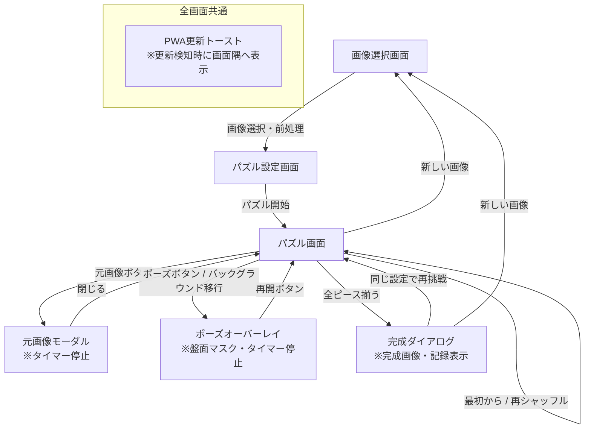

# App Slide Puzzle Lab 要件定義書

| 項目 | 内容 |
| --- | --- |
| 文書バージョン | 0.2 |
| 作成日 | 2026-09-23 |
| 最終更新日 | 2026-09-24 |
| 対象 | MVP（初期リリース） |
| アプリ形態 | 完全ローカルで動作するWebアプリ／PWA |

## 改訂履歴

| バージョン | 改訂日 | 改訂者 | 改訂内容 |
| --- | --- | --- | --- |
| 0.1 | 2026-09-23 | - | 初版作成 |
| 0.2 | 2026-09-24 | - | レビュー精査に基づく推奨案・推奨方針の反映： ・空白マスの初期位置（右下端）を規定 ・難易度・判別性対策として「ピース番号表示（ON/OFF）」をMVPに追加 ・スマホ写真のExif回転自動補正および透過画像の背景マット処理を追加 ・クロップUI操作仕様および画像リサイズ上限（長辺最大1024px）を定義 ・タイマー仕様の改善（元画像確認中の一時停止、手動ポーズおよびバックグラウンド自動ポーズの追加） ・操作性の向上（スワイプ判定閾値20〜30px、キーボード方向の定義、アニメーション短縮・先行入力対応） ・シャッフル時の崩れ度合い検証（合致数過多時の再試行）を追加 ・PWA更新通知の表示仕様（控えめなトースト表示・手動更新）を定義 ・第16章「未決事項」を確定事項として各仕様へ統合・整理 |

---

## 1. 概要

### 1.1 目的

利用者が端末内の写真や画像を取り込み、複数のピースに分割されたスライドパズルとして、通信を必要とせずに楽しめるWebアプリを提供する。

### 1.2 背景

一般的なスライドパズルは、1マスを空白にした盤面上で、その空白に隣接するピースを移動し、分割された画像を元の1枚の絵に戻すゲームである。本アプリでは、利用者自身の画像を使用できることと、分割数およびシャッフルの度合いを個別に選べることを特徴とする。

### 1.3 基本方針

- 画像の選択、加工、パズル生成、プレイ、完成判定を端末内で完結させる。
- 選択した画像を外部サーバーへ送信しない。
- 初回の読み込み後は、オフラインでも利用できるPWAとする。
- スマートフォンでのタッチ操作を優先し、PCのマウス操作およびキーボード操作にも完全対応する。
- 生成する盤面は必ず完成可能とする。
- 難易度は「分割数」と「シャッフルの度合い」の2軸で設定できるようにし、さらに視認性補助として「ピース番号表示」を提供する。

---

## 2. 対象範囲

### 2.1 MVPに含める機能

- 端末内の画像選択（Exif回転自動補正、透過背景の自動マット合成、長辺最大1024pxへの自動リサイズ）
- 画像の表示範囲調整（ピンチイン/アウト、ドラッグ、ホイールによる正方形枠内調整、余白なし制限）
- 分割数の選択（3×3、4×4、5×5、6×6）
- シャッフルの度合いの選択（軽め、標準、強め）
- 完成可能な盤面の生成（空白マス右下端固定、崩れ度合い検証付き合法手シミュレーション）
- タップ、クリックまたはスワイプによるピース移動（先行入力・連打追従）
- キーボード操作（空白方向へピース移動、操作ガイド表示）
- ピース番号の表示切り替え（ON/OFF）
- 手数および経過時間の計測
- パズルの一時停止（手動ポーズボタン、およびブラウザバックグラウンド移行時の自動ポーズ）
- 元画像の確認（確認中はタイマー一時停止）
- パズルのやり直しおよび再シャッフル
- 完成判定と完成結果の表示
- レスポンシブ対応（スマートフォン縦向き、タブレット、PC）
- PWAインストールおよびオフライン起動、プレイを妨げないPWA更新トースト通知

### 2.2 MVPに含めない機能

- ユーザーアカウント
- サーバーへの画像またはプレイ記録の保存
- 複数端末間の同期
- ランキング、対戦、共有機能
- カメラの直接起動による撮影（ファイル選択ダイアログ経由の撮影は端末標準機能に依存）
- 複数画像のライブラリ管理
- ベストタイムおよび最少手数の永続保存
- 自動解答、最短手数の算出、AIヒント
- ジグソーパズル形式
- 空白マスを使用しないピース入れ替え形式

---

## 3. 想定利用者と利用環境

### 3.1 想定利用者

- 手持ちの写真やイラストを使って気軽にパズルを楽しみたい人
- ネットワーク接続やアカウント登録なしで安心して利用したい人
- スマートフォン、タブレットまたはPCの一般利用者

### 3.2 対象環境

- スマートフォン、タブレット、PCのモダンブラウザ
- 最新版および主要な1世代前のChrome、Edge、Safari、Firefoxを基本対象とする
- iOS SafariおよびAndroid Chromeで主要機能（タッチ、スワイプ、PWAインストール）を利用できること
- JavaScriptおよびブラウザストレージ（localStorage）が有効であること

---

## 4. ユースケース

### UC-01 新しいパズルを作成する

1. 利用者が端末内の画像を選択する。
2. アプリが画像をブラウザ内で読み込み、Exif回転情報を自動補正し、長辺最大1024pxに最適化する（透過画像の場合は白背景を合成）。
3. 利用者が画像の表示範囲をドラッグ・ピンチ操作等で正方形枠内に調整する。
4. 利用者が分割数、シャッフルの度合い、およびピース番号表示の初期状態（ON/OFF）を選択する。
5. 利用者がパズルを開始する。
6. アプリが右下端を空白マスとした完成状態から合法手を適用し、完成可能かつ十分に崩れた初期盤面を生成して表示する。

### UC-02 パズルをプレイする

1. 利用者が空白マスに隣接するピースをタップ/クリックするか、空白方向へスワイプ、または対応する矢印キーを押下する。
2. アプリがピースを空白マスへスムーズに移動する（アニメーション中も次の入力を1手分受け付ける）。
3. アプリが手数と経過時間を更新する。
4. 完成するまで操作を繰り返す。

### UC-03 元画像を確認する

1. 利用者が「元画像」操作を選択する。
2. アプリがタイマーの計測を一時停止し、元画像をモーダルで大きく表示する。
3. 利用者が表示を閉じると、タイマーが再開し、直前の盤面へ戻る。
4. 元画像の確認は手数に加算しない。

### UC-04 パズルを一時停止する（ポーズ）

1. 利用者が「一時停止」ボタンを押下する、またはブラウザのタブがバックグラウンドに切り替わる。
2. アプリがタイマーを停止し、盤面をマスク（非表示化）してポーズ画面を表示する。
3. 利用者が「再開」ボタンを押下すると、タイマーが再開し、盤面マスクが解除される。

### UC-05 パズルをやり直す

- 「最初から」を選択した場合、現在と同じ初期配置へ戻し、手数を0、経過時間を0にリセットする。
- 「再シャッフル」を選択した場合、現在の画像・難易度設定を維持して別の新しい盤面を生成する。
- プレイ進行中に実行する場合は、誤操作防止のため確認ダイアログを表示する。

### UC-06 パズルを完成する

1. アプリが各ピースの位置および右下端の空白マスを完成状態と照合する。
2. 完成時にタイマーを停止し、ピース操作をロックする。
3. 空白マスに対応する画像ピースを補完表示し、1枚の完成画像として表示する。
4. 経過時間と手数を完成ダイアログに表示する。
5. 利用者は同じ設定で再挑戦（再シャッフル）するか、新しい画像を選択できる。

---

## 5. 画面構成

| 画面・コンポーネント | 主な内容・役割 |
| --- | --- |
| **画像選択画面** | アプリ概要、画像選択（ファイル参照）、端末内処理（ローカル完結）の安心案内 |
| **パズル設定画面** | 画像プレビュー、正方形切り抜き調整（ドラッグ・拡大縮小）、分割数、シャッフル度合い、ピース番号表示スイッチ、開始ボタン |
| **パズル画面** | パズル盤面、手数、経過時間、各種操作ボタン（元画像、ポーズ、番号ON/OFF、最初から、再シャッフル、新しい画像）、キーボード操作ガイド |
| **元画像モーダル** | 調整後の完成画像を大きく確認できる全画面オーバーレイ（表示中タイマー一時停止） |
| **ポーズオーバーレイ** | 盤面マスク、経過時間、再開ボタン（バックグラウンド移行時および手動操作時） |
| **完成ダイアログ** | 欠落のない完成画像、最終手数、最終経過時間、同じ設定で再挑戦、新しい画像 |
| **PWA更新トースト** | 画面隅に表示される控えめな更新通知バナー（「新しいバージョンが利用可能です [再読み込み]」） |
| **エラー・案内表示** | 読み込み失敗、非対応形式、メモリ制約などのわかりやすい案内と復帰ボタン |

---

## 6. 機能要件

### FR-01 画像選択と前処理

- 利用者は端末内の画像ファイルを1件選択できる。
- 対応形式はJPEG、PNG、WebPを必須とする。HEIC等ブラウザ依存の強い形式はMVP対象外とし、非対応時は案内を表示する。
- **Exif Orientationの自動補正**: スマートフォン撮影写真等に含まれるExif回転メタデータを認識し、常に正しい向きで展開する。
- **透過画像の背景処理**: アルファチャンネルを持つPNG/WebP画像の場合、透明部分はデフォルトの白背景（#FFFFFF）で塗りつぶし、空白マスとの識別不能を防ぐ。
- **最大入力サイズと縮小最適化**:
  - ファイル選択時のファイルサイズ上限は特に設けないが、長辺が1024pxを超える画像はブラウザ内（Canvas）で長辺最大1024px（アスペクト比維持）に自動縮小してメモリに展開する。
  - これによりモバイルブラウザのメモリ枯渇やクラッシュを防ぎ、安定した描画性能を確保する。
- 選択した画像は外部へ送信せず、IndexedDBやサーバーへも永続保存しない。

### FR-02 画像の表示範囲調整（クロップ）

- パズル盤面は正方形（アスペクト比 1:1）とする。
- **操作仕様**:
  - タッチ端末: ピンチイン/ピンチアウトによる拡大縮小、1本指ドラッグによる移動。
  - PC端末: マウスホイールまたはUI上のスライダーによる拡大縮小、マウスドラッグによる移動。
- **余白なし制限**: 正方形の切り抜き枠内に余白（レターボックス）が生じないよう、最小拡大率は「画像が正方形枠全体を満たすサイズ」を下回らないよう制御する。
- 初期表示では画像の中央を基準に正方形枠へ自動配置する。
- 設定画面でプレビューした切り抜き画像（1024×1024px）と、実際のパズル盤面で使用する画像データを完全一致させる。

### FR-03 難易度・表示設定

難易度および補助表示は、以下の項目を個別に設定できるものとする。

#### FR-03-1 分割数

| 選択肢 | 総マス数 | ピース数 | 1マスあたりのサイズ感（画面幅360px時目安） |
| --- | ---: | ---: | --- |
| 3×3 | 9 | 8 | 約106px |
| 4×4（初期値） | 16 | 15 | 約80px |
| 5×5 | 25 | 24 | 約64px |
| 6×6 | 36 | 35 | 約53px（指でのタップ可能サイズ） |

- 分割数に応じた格子状に画像を等分割する。
- UI上の選択肢には「3×3」「4×4」等の数値を明記する。

#### FR-03-2 シャッフルの度合い

| 選択肢 | 説明 | 合法手数の基準（ステップ数） |
| --- | --- | ---: |
| 軽め | 完成状態に近く、短時間で遊びやすい | 総マス数 × 3 |
| 標準（初期値） | 適度に混ざった標準的な配置 | 総マス数 × 10 |
| 強め | 十分に混ざった本格的な配置 | 総マス数 × 30 |

- 設定値（倍率）は定数ファイルで一元管理し、プレイテスト結果に応じて容易に調整可能な構造とする。

#### FR-03-3 ピース番号表示（視認性補助）

- 各ピースに正解位置を示すインデックス番号（左上から順に 1, 2, ..., N-1）を表示する機能を提供する。
- 空白マス（右下端）には番号を表示しない。
- 初期値は「OFF」とする。
- パズル設定画面だけでなく、**パズル画面上でもいつでもワンタップでON/OFFを切り替え可能**とする。
- 風景写真や単色グラデーションなど、絵柄だけでは配置が判別しにくい画像の詰み防止を目的とする。

### FR-04 盤面生成とシャッフル

- **空白マスの規定位置**: 完成状態における空白マスの位置は**「右下端（最下行・最右列）」**に固定する。
- **生成手順**:
  1. 右下端を空白とする完成状態の盤面を初期化する。
  2. 空白マスに上下左右で隣接するピースの移動候補（合法手）を列挙する。
  3. 直前の移動をそのまま元に戻す手（逆移動）を原則として除外する（他に移せるピースがない隅などの場合を除く）。
  4. 残った候補から均等な乱数で1手選択し、空白とピースを入れ替える。
  5. 指定されたシャッフルの度合いに対応する手数まで上記を繰り返す。
  6. **崩れ度合いの検証**:
     - シャッフル終了時に完成状態と一致していないことを確認する。
     - 正解位置にとどまっているピースの数が全体の過半数（50%超）を占める場合は、十分な崩れが得られていないと判定し、再シャッフルを行う。
- これにより、「必ず完成可能」かつ「手ごたえのある崩れ方」を保証する。
- シャッフル処理中の盤面変化は画面に描画せず、手数および経過時間に加算しない。盤面表示が完了した時点でタイマーを開始する。

### FR-05 ピース操作

- 空白マスに上下左右で隣接するピースのみ移動可能とする。
- **入力方式**:
  - タップ / クリック: 隣接ピースを直接タップ/クリックすると空白マスへスライドする。
  - スワイプ / フリック: 隣接ピースを空白マスの方向へスワイプする。
    - 判定閾値: **移動距離 20〜30px 以上**。
    - 斜め方向に入力された場合は、移動量の大きい主軸（X軸またはY軸）を採用する。
  - キーボード操作: **「空白の方向へピースを動かす」**規則とする。
    - 例: 空白の「下」にあるピースを「↑」キーで上に移動させる。
    - 画面下部に矢印キーの操作ガイドアイコンをわかりやすく表示する。
- 無効な操作（空白に隣接しないピースのタップ、移動できない方向へのスワイプ/キー入力）は盤面を変更せず、手数にも加算しない。
- 有効なピース移動1回につき手数を1加算する。
- **連続操作とアニメーション制御**:
  - 移動アニメーションは軽快な短時間（**80〜120ms**）とする。
  - 連打や高速フリック時に操作が取りこぼされないよう、アニメーション中も盤面の論理状態は即時に更新し、描画をスムーズに追従させる（または最大1手分の先行入力をバッファリングする）。
  - `prefers-reduced-motion` 有効時はアニメーション時間を0ms（即時切り替え）とする。

### FR-06 手数・経過時間と一時停止

- パズル画面に現在の手数と経過時間（1秒単位）を常時表示する。
- 経過時間は盤面の初回表示完了と同時に計測を開始し、完成時に停止する。
- **一時停止（ポーズ）の仕様**:
  - **元画像確認中**: モーダル表示中はタイマーを自動的に一時停止し、閉じた直後に再開する。
  - **手動ポーズ**: パズル画面の「一時停止」ボタンにより、盤面をマスクしてタイマーを一時停止できる。
  - **バックグラウンド移行**: ブラウザのタブ切り替えや他アプリ起動（`document.visibilityState === 'hidden'`）を検知した場合、自動的に一時停止状態へ移行し、復帰時はポーズ画面を表示してユーザーの再開操作を待つ。

### FR-07 元画像の確認

- プレイ中、いつでも調整後の完成画像（元画像）を全画面モーダルで大きく確認できる。
- 元画像表示中は盤面ピースを操作できない。
- 元画像の確認回数に制限はなく、確認操作は手数に加算しない。
- 確認中はFR-06に基づきタイマーを一時停止する。

### FR-08 やり直しと再シャッフル

- 「最初から」: 現在のパズルの初期盤面配置へ戻し、手数を0、経過時間を0にリセットする。
- 「再シャッフル」: 画像、切り抜き範囲、分割数、シャッフル度合いを維持したまま、新しい初期盤面を生成する。
- 「新しい画像」: 画像選択画面へ戻る。
- プレイ途中で進行状況がリセットされる操作（1手以上動かしている状態での「最初から」「再シャッフル」「新しい画像」）には、誤操作防止の確認ダイアログを表示する。

### FR-09 完成判定

- 全ピースが正解位置に配置され、空白マスが右下端にある状態になった直後に完成と判定する。
- 完成時は、右下端の空白マスにも対応する画像領域を補完描画し、欠落のない1枚絵として表示する。
- 盤面のピース操作を完全にロックする。
- 完成ダイアログを表示し、最終手数、最終経過時間、および「同じ設定で再挑戦」「新しい画像」の選択肢を提供する。

### FR-10 PWA・オフライン対応

- Web App Manifest を備え、スマートフォンのホーム画面追加やPCのPWAインストールに対応する。
- Service Worker により、HTML、JS、CSS、アイコン等の静的リソースを完全にキャッシュする（CacheFirst 戦略）。
- 初回のオンライン読み込み後は、機内モードや圏外等の完全オフライン環境でも起動し、全機能を利用可能とする。
- **更新通知のUX**:
  - アプリの更新（Service Workerの更新）が検知された場合、プレイ中の強制リロードを防止するため、画面隅（ヘッダーまたはフッター近辺）に控えめなトーストバナー（「新しいバージョンが利用可能です [更新]」）を表示する。
  - 利用者が「更新」をタップしたタイミングで新しいService Workerをアクティベートし、画面を再読み込みする。

### FR-11 設定保持（ローカル永続化）

- 以下の設定項目はブラウザの `localStorage` に保存し、次回起動時の初期値として復元する。
  - 最後に選択した分割数
  - 最後に選択したシャッフルの度合い
  - ピース番号表示のON/OFF設定
- 選択した画像データおよび切り抜き後の画像は、プライバシー保護と容量圧迫防止のためローカルストレージには一切保存しない。
- ブラウザのキャッシュや閲覧データを全削除した場合も、デフォルト初期値（4×4、標準、番号OFF）で正常に起動すること。

---

## 7. 非機能要件

### NFR-01 プライバシーとセキュリティ

- 選択した画像ファイル、パズルデータ、プレイ記録を外部サーバーへ一切送信しない。
- アプリの主要機能に外部API通信を一切使用しない。
- サードパーティ製スクリプト、トラッカー、外部フォントの実行時ロードを行わず、すべての静的リソースをセルフホストする。
- 画像選択画面に「画像は端末内でのみ処理され、外部へ送信されません」という安心メッセージを明示する。
- 選択されたファイルを画像（イメージデータ）としてのみデコードし、スクリプト実行等の脆弱性を排除する。

### NFR-02 性能

- 一般的なスマートフォンにおいて、画像選択から設定画面の表示まで通常2秒以内を目標とする。
- パズル開始ボタン押下から盤面表示まで通常0.5秒以内を目標とする。
- ピース移動の操作遅延（入力からアニメーション開始まで）は体感上ゼロ（16ms以内）とする。
- 長辺最大1024pxへの事前リサイズにより、Canvas描画のメモリフットプリントを数MB程度に抑え、低スペック端末でも滑らかに動作させる。

### NFR-03 ユーザビリティ

- スマートフォン縦画面（幅360px〜）において、6×6分割時でも1ピースあたり約50px以上のタップターゲットを確保し、誤タップを防ぐ。
- 各ピースの境界線を視認しやすいデザイン（わずかな隙間または境界線ボーダー）とする。
- 破壊的操作（最初から、再シャッフル、新しい画像）は、メイン操作とボタン色・配置を視覚的に明確に区別する。
- 専門用語を排除し、子供やシニアでも直感的に理解できる平易な日本語UIとする。

### NFR-04 アクセシビリティ

- ファイル選択ボタンを含め、すべての操作要素にキーボード（Tab / Enter / Space / 矢印キー）でアクセス可能とする。
- 現在のフォーカス位置を視認性の高いフォーカスリングで明示する。
- 色覚特性に配慮し、ピース番号やUI要素のコントラスト比（WCAG 2.1 AA準拠、4.5:1以上）を確保する。
- `prefers-reduced-motion: reduce` の環境では、ピース移動やモーダルのトランジションアニメーションを即時表示に切り替える。

### NFR-05 信頼性

- 高速な連続タップ・フリック、画面回転、タブ切り替え、電話着信等の割り込みが発生しても、盤面の状態や手数の整合性が破損しないこと。
- メモリ不足等の予期せぬ描画エラーが発生した場合は、アプリがハングアップせず、安全に初期画面へ戻るエラーハンドリングを備えること。

### NFR-06 保守性

- 分割数、シャッフル倍率、リサイズ上限解像度、スワイプ閾値などの定数は設定ファイル（`config.ts`等）に集約する。
- パズルロジック（盤面配列、合法手生成、シャッフル、完成判定）はUI（Reactコンポーネント）から完全に分離した純粋関数として実装し、ヘッドレスで網羅的な単体テストが可能なアーキテクチャとする。

---

## 8. データ要件

### 8.1 一時データ（メモリ管理）

- 選択された元画像オブジェクト（`File` / `ImageBitmap`）
- クロップ後の正方形画像データ（`Canvas` / `Blob URL`）
- 各ピースの正解インデックスと現在配置配列
- 空白マスの現在インデックス（完成時は右下端）
- 開始時の初期盤面配列
- 現在の手数（整数）
- プレイ開始時刻、累積経過時間、ポーズ開始時刻
- プレイ状態（未開始、プレイ中、ポーズ中、完成）

これらは原則としてブラウザメモリ内（Reactステート等）で管理し、ページ離脱時は破棄する。

### 8.2 永続データ（localStorage）

- `slide_puzzle_grid_size`: 最後に選択した分割数（初期値: 4）
- `slide_puzzle_shuffle_level`: 最後に選択したシャッフル度合い（初期値: "standard"）
- `slide_puzzle_show_numbers`: ピース番号表示設定（初期値: false）

---

## 9. 画面遷移

- 未完成状態から「新しい画像」を選択した場合は確認ダイアログを表示する。
- モーダルおよびオーバーレイ表示中は、背景のパズル盤面のタップ操作を遮断する。

---

## 10. シャッフル仕様の補足

### 10.1 基本アルゴリズム

1. $N \times N$ の盤面において、右下端（インデックス $N^2 - 1$）を空白マスとした完成状態を生成する。
2. 空白マスに隣接する有効な移動可能方向（上・下・左・右）を判定し、候補ピースを列挙する。
3. 直前の一手で移動したピースを元の位置に戻す移動は、移動候補から除外する（隅等で候補が他にない場合を除く）。
4. 候補の中から乱数で1つを選択し、空白マスとピースを入れ替える。
5. 難易度に応じた総手数（$N^2 \times 3, 10, 30$）に達するまで手順2〜4を繰り返す。
6. **崩れ度合い検証**:
   - 盤面が完成状態でないことを確認する。
   - 正解位置と現在位置が一致しているピースの個数をカウントし、全体の50%以下であることを確認する（50%を超える場合は、局所ループにより崩れが不十分とみなし、手順1から再試行する）。
7. 生成された配置を「初期配置」として保存し、手数を0、経過時間を0としてプレイヤーに操作権を渡す。

### 10.2 難易度調整に関する方針

- 合法手数の指定により、数学的に「可解（解が存在する）」であることを100%保証する。
- MVPでは総マス数に応じた係数（×3, ×10, ×30）を採用し、プレイテストを通じて必要に応じて微調整する。

---

## 11. エラー処理

| 発生状況 | エラー内容 | アプリの対応・メッセージ |
| --- | --- | --- |
| ファイル選択 | HEICや非対応形式、破損ファイル | 「対応していない画像形式です。JPEG、PNG、またはWebP画像を選択してください。」と表示し、再選択を促す。 |
| メモリ・描画 | 極端に巨大な画像やCanvas描画失敗 | 「画像の読み込みに失敗しました。別の画像を選択するか、少し小さめの画像をお試しください。」と表示し、安全に画像選択画面へ戻る。 |
| オフライン起動 | 初回アクセス時にネットワーク未接続 | ブラウザ標準のオフライン画面が表示される（初回のみ通信が必要な旨を案内）。 |
| PWA更新 | Service Workerの更新取得失敗 | 現在のバージョンでそのままプレイを継続し、次回接続時に再試行する。 |

---

## 12. 受入条件

### AC-01 画像処理とプライバシー
- JPEG、PNG、WebP画像を選択でき、外部サーバーとの通信が一切発生しないこと。
- スマホ等で撮影した縦向き・横向き写真の向き（Exif）が正しく補正されて表示されること。
- 透過画像を選択した際、背景が白で適切に塗りつぶされて表示されること。
- 長辺1024pxを超える画像が、アスペクト比を維持して1024px以下に最適化されて読み込まれること。

### AC-02 クロップと難易度設定
- 画像プレビュー上で、余白を生じさせずに正方形の切り抜き範囲を直感的に調整できること。
- 分割数（3×3、4×4、5×5、6×6）およびシャッフルの度合い（軽め、標準、強め）が選択でき、選択通りの盤面が生成されること。
- ピース番号表示のON/OFFが設定でき、プレイ画面上でも即座に表示/非表示を切り替えられること。

### AC-03 完成保証とシャッフル
- 生成された盤面が常に完成可能であり、シャッフル直後に完成状態になっていないこと。
- 空白マスの完成時位置が「右下端」になっていること。
- 軽め・標準・強めそれぞれにおいて、ピースが適正に崩れていること。

### AC-04 パズル操作性
- 空白マスに隣接するピースのみがタップ/クリックでスムーズに移動すること。
- タッチ端末において、20〜30px以上のスワイプ操作で空白方向へピースが移動すること。
- キーボードの矢印キーで「空白の方向へピースを動かす」直感的な操作ができること。
- 高速操作時（連打）でもアニメーションや入力の取りこぼしがなく、盤面配列が破損しないこと。

### AC-05 計測と一時停止
- 手数が有効移動ごとに1ずつ正確に加算されること。
- 経過時間が1秒単位で計測され、元画像確認中およびポーズ中はタイマーが確実に停止すること。
- ブラウザのタブを切り替えた際、自動的にポーズ状態へ移行し、時間が不正に進まないこと。

### AC-06 完成とやり直し
- 全ピースが正解位置（空白が右下端）に揃った瞬間に完成と判定され、空白マスが補完されて1枚絵が表示されること。
- 「最初から」で開始時の配置・手数0・時間0へ戻り、「再シャッフル」で同じ設定の別盤面が生成されること。

### AC-07 PWA・オフライン
- 初回読み込み完了後、端末を機内モード（完全オフライン）にしてもアプリを起動し、パズルの作成・プレイ・完成まで正常に行えること。
- 新バージョンがある場合、プレイを阻害しないトースト通知が表示され、タップで更新できること。

### AC-08 アクセシビリティ
- キーボードのみで画像の選択から設定、プレイ、完成ダイアログの操作まで完結できること。
- `prefers-reduced-motion` 設定時にアニメーションが無効化されること。

---

## 13. テスト観点

### 13.1 機能・UIテスト
- 各種画像（縦長、横長、正方形、透過PNG、高解像度Exif付き写真）の読み込みとクロップ表示
- 全分割数（3×3〜6×6）× 全シャッフル度合い（軽め・標準・強め）の盤面生成確認
- タップ、クリック、スワイプ（上下左右、斜め入力）、キーボード（↑↓←→）の各入力確認
- 連打・フリック時のアニメーション追従と先行入力バッファの整合性検証
- ピース番号表示のON/OFF切り替え表示テスト
- 元画像表示および手動ポーズ時のタイマー一時停止・再開確認
- ブラウザタブ切り替え時のバックグラウンド自動ポーズと復帰確認
- 「最初から」「再シャッフル」「新しい画像」の確認ダイアログ挙動

### 13.2 ロジック・単体テスト
- 空白位置（右下端）および初期配列の生成検証
- 空白位置に応じた合法手列挙（四隅: 2方向、辺: 3方向、中央: 4方向）の正確性
- 直前手の逆移動除外ロジックの検証
- シャッフル後の過半数一致除外（崩れ度合い検証）ロジックの検証
- ピース移動に伴う配列状態と空白位置の更新正確性
- 完成状態判定関数の真偽判定テスト（1ピースでもズレていればfalse、全一致かつ空白右下でtrue）

### 13.3 非機能・端末テスト
- 完全オフライン（Service Workerキャッシュ）での起動・動作テスト
- iOS Safari（最新・前バージョン）およびAndroid Chrome実機でのタッチ・スワイプ操作感検証
- 4000万画素級のスマートフォン写真読み込み時のメモリ消費とリサイズ処理速度検証
- PWAのホーム画面追加（インストール）とアイコン・スプラッシュ表示検証
- 外部ネットワークへの通信が一切発生していないことのDevTools Network検証

---

## 14. 推奨技術構成

| 領域 | 推奨技術 | 選定理由 |
| --- | --- | --- |
| **フロントエンド** | React 18+ / 19, TypeScript, Vite | 軽快な開発体験、強固な型安全性、コンポーネント指向による盤面・UI分離の容易さ |
| **画像処理** | HTML5 Canvas API | ブラウザ標準機能で完結し、Exif補正、リサイズ、正方形クロップ、ピース分割描画を軽量に実現可能 |
| **PWA / オフライン** | `vite-plugin-pwa` (Workbox) | 静的リソースの確実なプリキャッシュと、`registerType: 'prompt'` による安全な更新トースト制御 |
| **状態管理** | React 標準機能 (`useState`, `useReducer`, `useRef`) | 外部ライブラリ不要。アニメーション整合性やタイマー制御を `useRef` と `useReducer` で堅牢に管理 |
| **永続化** | `localStorage` | 分割数、シャッフル度合い、番号表示設定のシンプルなキー・バリュー保存 |
| **スタイリング** | Tailwind CSS または CSS Modules | 軽量、レスポンシブ対応、`prefers-reduced-motion` やタッチ領域の柔軟な制御 |
| **テスト** | Vitest + React Testing Library | ロジックの高速なヘッドレス単体テストとUIインタラクションテスト |

---

## 15. 将来拡張候補（フェーズ2以降）

- カメラAPIによるアプリ内直接撮影
- 複数画像の端末内ライブラリ保存（IndexedDB活用）
- ベストタイム・最少手数のローカル記録と履歴表示
- 半透明の完成画像を背後に重ねる「ゴーストガイド」表示
- 段階的な次の1手ヒント
- 任意の長方形アスペクト比盤面
- ジグソーパズルモード / 空白なしピース入れ替えモード
- 端末内乱数シードによる「今日のデイリーパズル」
- 高コントラストテーマ、カラーユニバーサルデザイン対応

---

## 16. 確定事項と実機調整項目

### 16.1 本版で確定した仕様

1. **画像の最大入力サイズと縮小解像度**: 長辺最大1024px（正方形クロップ後 1024×1024px）へブラウザ内で自動縮小する。
2. **スワイプ判定の閾値**: 移動距離20〜30px以上。斜め入力は移動量の大きい主軸を判定する。
3. **キーボード操作規則**: 「空白の方向へピースを動かす」規則（例: 空白の下のピースを「↑」で上へ動かす）とし、操作ガイドを常時表示する。
4. **元画像表示・バックグラウンド時のタイマー**: 元画像表示中および手動ポーズ中、タブ非表示時はタイマーを一時停止する。
5. **空白マスの規定位置**: 右下端（最下行・最右列）に固定する。
6. **ピース番号表示**: 視認性・アクセシビリティ担保のためMVP機能として採用し、ON/OFF切り替え可能とする。
7. **PWA更新通知**: プレイを妨げない控えめなトーストバナー形式（手動更新）とする。

### 16.2 プレイテスト・実機検証での調整項目

実装後の実機動作確認およびプレイテストを通じて、以下の微調整を行う。

- **シャッフル倍率の体感調整**: 初期値（×3, ×10, ×30）における崩れ度合いと解きごたえのバランス確認。
- **6×6盤面の実機操作感**: 小型のスマートフォン実機において、境界線やピース番号のフォントサイズが適切か確認。
- **先行入力バッファの猶予時間**: 高速フリック時の心地よい操作感に向けたアニメーション時間（80〜120ms）の最終チューニング。
