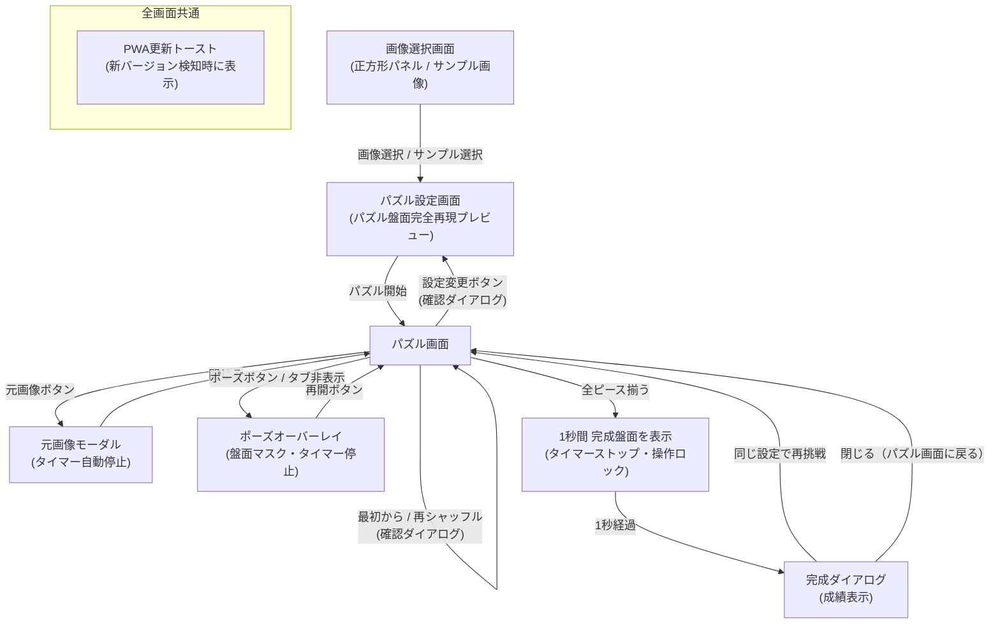

# App Slide Puzzle Lab 要件定義書

| 項目 | 内容 |
| --- | --- |
| 文書バージョン | 1.0 |
| 作成日 | 2026-09-23 |
| 最終更新日 | 2026-09-24 |
| 対象 | 正式版（v1.0.0） |
| アプリ形態 | 完全ローカルで動作するWebアプリ／PWA |

## 改訂履歴

| バージョン | 改訂日 | 改訂者 | 改訂内容 |
| --- | --- | --- | --- |
| 0.1 | 2026-09-23 | - | 初版作成 |
| 0.2 | 2026-09-24 | - | レビュー精査に基づく推奨案・推奨方針の反映（空白マス右下固定、ピース番号表示、Exif回転補正、1024px縮小、ポーズ仕様、操作性向上等） |
| 1.0 | 2026-09-24 | - | **正式初版（v1.0.0）としての仕様確定と実機UI/UX最適化の反映**： ・完成時演出の改善（完成直後にタイマー停止・操作ロック後、1秒間完成盤面を見せてからお祝いダイアログを表示） ・完成後の盤面表示仕様の更新（ダイアログを閉じた後も空白マスは埋めず、欠落した本来のパズル盤面の状態を維持） ・お祝いダイアログのUI改訂（「新しい画像」ボタンを削除し、「閉じる（パズル画面に戻る）」ボタンを追加） ・パズル画面操作バーの最適化（上部ナビを撤去し、下部バーに「設定変更」を配置して設定画面への復帰動線を確立） ・パズル設定プレビューおよび画像選択パネルの正方形（1:1）およびパズル盤面デザイン（角丸・隙間・立体感・破線・番号連動）の完全統一 ・トップ画面における「サンプル画像ですぐに試す」動線の追加 ・PWA完全対応（各種高解像度アプリアイコン群の完備、iOS Safari用PWAメタタグ、ノッチ対応、マニフェスト完全化） |
| 1.1 | 2026-09-24 | - | **最短手数表示機能の追加（追加指示書準拠）**： ・プレイ開始時の初期配置に対する最短手数の表示（3×3双方向BFS・4×4 IDA*による厳密解探索、3,000msタイムアウト制限） ・5×5・6×6およびタイムアウト時の空白除外マンハッタン距離による下限表示（`最短 XX手以上`） ・Web Worker非同期探索によるUI完全非ブロック化とライフサイクル管理（再シャッフル・離脱時の安全な破棄） ・ヘッダーおよび完成ダイアログへの最短手数表示の統合 ・「最短手数はMVP対象外」の記述を解消し正式機能として策定 |

---

## 1. 概要

### 1.1 目的

利用者が端末内の写真や画像を取り込み、複数のピースに分割されたスライドパズルとして、通信を必要とせずに安心して楽しめるWebアプリを提供する。

### 1.2 背景

一般的なスライドパズルは、1マスを空白にした盤面上で、その空白に隣接するピースを移動し、分割された画像を元の1枚の絵に戻すゲームである。本アプリでは、利用者自身の画像を使用できること、分割数およびシャッフルの度合いを個別に選べること、そして完全ローカルかつオフライン（PWA）で軽快に動作することを特徴とする。

### 1.3 基本方針

- 画像の選択、加工、パズル生成、プレイ、完成判定のすべての処理を端末（ブラウザ）内で完結させる。
- 選択した画像を外部サーバーへ一切送信しない。
- 初回の読み込み後は、完全オフライン環境（機内モード等）でも利用できるPWAとする。
- スマートフォンでのタッチ・スワイプ操作を優先し、PCのマウスおよびキーボード操作にも完全対応する。
- 生成する盤面は数学的に必ず完成可能とする。
- 難易度は「分割数」と「シャッフルの度合い」の2軸で設定できるようにし、視認性補助として「ピース番号表示」を提供する。
- 各画面のコンポーネント（画像選択パネル、設定プレビュー、パズル盤面）は同一の正方形比率・角丸・隙間・立体感を持たせ、視覚的一貫性を徹底する。

---

## 2. 対象範囲

### 2.1 正式版（v1.0）に含まれる機能

- **画像選択と前処理**:
  - 端末内の画像選択（JPEG、PNG、WebP対応）
  - Exif回転情報の自動補正
  - 透過画像の自動白背景マット合成
  - 長辺最大1024pxへの自動リサイズ最適化
  - すぐに体験できる「サンプル画像で試す」動線
  - パズル盤面と同一比率の正方形（1:1）画像選択パネル
- **表示範囲調整（クロップ）とリアルタイムプレビュー**:
  - ドラッグ・ホイール・ピンチ・ズームスライダーによる正方形枠内調整（余白なし制限）
  - 実際のパズル盤面と全く同一の角丸（3px）、隙間、立体エッジ、空白マス破線、番号連動を再現したリアルタイムプレビュー
- **難易度・補助設定**:
  - 分割数の選択（3×3、4×4、5×5、6×6）
  - シャッフルの度合いの選択（軽め、標準、強め）
  - ピース番号の表示切り替え（ON/OFF、プレイ中も即時切替可能）
- **完成保証盤面の生成**:
  - 右下端を空白マスとした完成可能配置の生成（合法手逆行防止シミュレーション）
  - シャッフル終了時の崩れ度合い検証（50%超一致時の自動再試行）
- **直感的なピース操作**:
  - タップ / クリックによるピース移動
  - 20〜30px閾値のスワイプ / フリックによるピース移動
  - キーボード操作（空白方向へピース移動、操作ガイド表示）
  - 軽快なアニメーション（80〜120ms）と先行入力追従
- **計測・一時停止・元画像確認**:
  - 手数および経過時間のリアルタイム計測
  - 手動ポーズ（盤面マスク）およびブラウザバックグラウンド移行時の自動ポーズ
  - 元画像モーダル確認（確認中はタイマー自動一時停止）
- **最短手数表示（Web Worker非同期探索）**:
  - 初期配置スナップショットに対する最短手数の算出・表示
  - 3×3（双方向BFS）および4×4（IDA*）の厳密解探索（暫定上限 3,000ms）
  - 5×5・6×6および3秒タイムアウト時の空白除外マンハッタン距離による下限表示（`最短 XX手以上`）
  - UIスレッド完全非同期化（プレイ操作を一切阻害しない）
  - ヘッダーおよびクリアお祝いダイアログでの結果表示
- **やり直し・設定変更動線**:
  - 「最初から」（初期配置・手数0・時間0へリセット、最短手数結果を再利用）
  - 「再シャッフル」（同じ設定で別の新しい盤面を生成、旧探索を安全に破棄）
  - 「設定変更」（現在のパズルから設定画面へ戻る、旧探索を破棄）
  - プレイ途中リセット時の誤操作防止確認ダイアログ
- **完成判定と演出**:
  - 全ピース揃い時の完成判定
  - タイマー即時停止およびピース移動ロック
  - **完成直後は1秒間完成盤面を表示**（余韻の確保）
  - **1秒後にクリアお祝いダイアログを表示**（成績カード、最短手数、同じ設定で再挑戦、閉じる）
  - ダイアログを閉じた後も**空白マスは欠落した状態（本来のパズル盤面）のまま表示**（移動不可）
- **PWA・オフライン対応**:
  - 各種高解像度アプリアイコン（192px、512px、マスカブル512px、Apple Touch 180px、Favicon 48px）完備
  - iOS Safari向けPWA全画面起動メタタグおよびノッチ・セーフエリア対応（`viewport-fit=cover`）
  - 完全オフライン（Service Worker）起動・動作
  - プレイを邪魔しない更新トースト通知

### 2.2 対象外の機能（将来拡張候補）

- ユーザーアカウント登録、ログイン
- サーバーへの画像保存・通信
- オンライン対戦、ランキング、SNS共有
- カメラの直接起動（OS標準のファイルピッカー依存）
- 複数画像の端末内ライブラリ保存
- 自動解答（オートプレイ）AI

---

## 3. 想定利用者と利用環境

### 3.1 想定利用者

- 手持ちの写真やイラストを使って自分だけのパズルを気軽に楽しみたい人
- 通信やアカウント登録なしでプライバシーを保って安心して遊びたい人
- スマートフォン、タブレット、PCの幅広い層の利用者

### 3.2 対象環境

- **スマートフォン・タブレット**: iOS Safari（最新および1世代前）、Android Chrome
- **PC**: Google Chrome、Microsoft Edge、Safari、Firefox
- JavaScript および localStorage が有効であること
- PWA（ホーム画面に追加）機能が利用可能であること

---

## 4. ユースケース

### UC-01 パズルを作成する
1. 利用者が「写真・画像をタップして選択」または「サンプル画像で試す」を選択する。
2. アプリが画像を端末内で読み込み、Exif回転補正、1024px縮小、透過白背景合成を行う。
3. 利用者がドラッグやズームスライダーで正方形切り抜き位置を調整する。
4. 設定画面のプレビュー上で、実際のパズルと同じ角丸・隙間・分割線・空白マスを確認する。
5. 利用者が分割数（3×3〜6×6）、シャッフル度合い（軽め・標準・強め）、ピース番号表示（ON/OFF）を選び、「パズルを開始する」を押下する。
6. アプリが完成可能な崩れた初期盤面を生成し、パズル画面を表示してタイマーを開始する。

### UC-02 パズルをプレイする
1. 空白に隣接するピースをタップするか、空白方向へスワイプ、または矢印キーを押下する。
2. ピースが空白マスへスムーズに移動し、手数が1加算される。
3. 必要に応じて「ピース番号」ボタンで番号バッジの表示/非表示を切り替える。

### UC-03 元画像を確認する
1. 操作バーの「元画像」ボタンを押下する。
2. タイマーが一時停止し、元画像が大きく全画面モーダルで表示される。
3. モーダルを閉じると、タイマーが再開して元のプレイ画面に戻る（手数は不変）。

### UC-04 一時停止（ポーズ）する
1. ヘッダーの「一時停止」ボタンを押す、またはブラウザの別タブへ切り替える。
2. タイマーが停止し、盤面がマスクされてポーズ画面が表示される。
3. 「再開」ボタンを押すと、盤面マスクが解除されてタイマーが再開する。

### UC-05 やり直す・設定を変更する
- 「最初から」: 開始時の初期盤面に戻し、手数と時間をリセットする。
- 「再シャッフル」: 同じ設定で別の崩れ方の盤面を新しく生成する。
- 「設定変更」: パズル設定画面に戻り、分割数や切り抜き位置を再設定できる。
- （プレイ途中の場合は誤操作防止確認ダイアログを表示する）

### UC-06 パズルを完成する
1. 最後のピースを動かして全ピースが正解位置（空白が右下端）に揃う。
2. **直ちにタイマーが停止し、ピース移動がロックされる。**
3. **完成した盤面が1秒間そのまま表示される。**
4. **1秒後、お祝いダイアログがふわりと表示される**（総手数、クリア時間、完成絵）。
5. 利用者は「同じ設定で再挑戦」するか、「閉じる（パズル画面に戻る）」を選択できる。
6. 「閉じる」を選択した場合、ダイアログが閉じ、完成した盤面（右下は空白のまま）をじっくり確認できる。

---

## 5. 画面構成とUI仕様

| 画面・コンポーネント | UI仕様・役割 |
| --- | --- |
| **画像選択画面** | ・アプリタイトル、文節単位で折り返される美しい説明文 ・パズル盤面と同じ正方形（1:1）・`rounded-2xl` のドロップゾーン ・ワンタップで即体験できる「サンプル画像で試す」ボタン ・完全ローカル安心案内バッジ |
| **パズル設定画面** | ・戻るボタン（別の画像を選ぶ） ・**パズル盤面完全再現プレビュー**（正方形、`bg-slate-800/95`、`rounded-2xl`、ピース角丸3px、隙間、立体エッジ、右下空白マス破線、番号バッジ連動） ・ドラッグによる位置調整＆ズームスライダー ・分割数セレクター（3×3〜6×6） ・シャッフル度合いセレクター（軽め・標準・強め） ・ピース番号表示スイッチ ・開始ボタン |
| **パズル画面** | ・ヘッダー（手数、1秒更新タイマー、一時停止ボタン、ピース番号切替ボタン、**最短手数表示バッジ**） ・**パズル盤面**（アスペクト比1:1、ダークスレート外枠、角丸3pxピース、立体シャドウ、空白マス） ・**操作バー（4ボタン均等配置）**：[元画像] [最初から] [再シャッフル] [設定変更] ・PC用キーボード操作ガイド |
| **元画像モーダル** | ・完成画像を大きく確認できるモーダル（表示中タイマー自動停止） |
| **ポーズオーバーレイ** | ・盤面マスク、経過時間、再開ボタン（手動ポーズ＆バックグラウンド検知連動） |
| **完成ダイアログ** | ・トロフィーアイコン、お祝いメッセージ ・完成した1枚絵（空白補完済み画像）プレビュー ・成績カード（総手数、クリアタイム、**最短手数**） ・アクションボタン：[同じ設定で再挑戦]、[閉じる（パズル画面に戻る）] |
| **PWA更新トースト** | ・画面右下に表示される控えめな更新通知バナー（更新ボタン・閉じるボタン） |
| **確認ダイアログ** | ・最初から、再シャッフル、設定変更時の進行破棄防止ダイアログ |

---

## 6. 機能要件詳細

### FR-01 画像選択と前処理
- **対応形式**: JPEG、PNG、WebP
- **Exif Orientation補正**: スマホ撮影写真の回転メタデータをCanvasで自動補正し、常に正しい向きで展開する。
- **透過背景処理**: アルファチャンネルを持つ画像は白背景（#FFFFFF）を自動合成する。
- **リサイズ最適化**: 長辺が1024pxを超える画像は長辺1024px（アスペクト比維持）に自動縮小する。
- **端数欠落のない高精度分割**: 1024pxをグリッド数で分割する際、比率計算による境界座標丸め（`Math.round`）を適用し、右端・下端の画素欠落や隙間・重複をゼロにする。
- **サンプル画像**: トップ画面に `/sample.jpg` を用意し、画像選択なしでもワンタップでパズルを開始できる。
- **UI比率**: 画像選択ドロップゾーンはパズル盤面と同一の正方形（1:1）および角丸（`rounded-2xl`）とする。

### FR-02 正方形クロップとリアルタイムプレビュー
- クロップ枠は正方形（アスペクト比 1:1、出力1024×1024px）固定とし、余白（レターボックス）を生じさせない。
- マウスドラッグまたはタッチドラッグによるパン位置移動、スライダーによるズーム（1.0〜2.5倍）をサポートする。
- **設定プレビューの仕様**:
  - 外枠はパズル画面と同一の `bg-slate-800/95 rounded-2xl shadow-xl border-2 border-slate-700/80`。
  - 各ピースはパズル画面と同じピース間ギャップ、各ピースの角丸（3px相当）、上部立体ハイライト、外周シャドウを描画する。
  - 右下端マスはパズル画面と同じ暗背景＋破線枠＋「空白」表示とする。
  - ピース番号スイッチがONの場合、各ピース左上に黒半透明の番号バッジ（1, 2, ...）をリアルタイム描画する。

### FR-03 難易度設定と補助表示
- **分割数**: 3×3（8ピース）、4×4（15ピース、初期値）、5×5（24ピース）、6×6（35ピース）
- **シャッフルの度合い**:
  - 軽め（総マス数 × 3 ステップ、正解位置50〜80%目安）
  - 標準（総マス数 × 10 ステップ、初期値、正解位置20〜50%目安）
  - 強め（総マス数 × 30 ステップ、正解位置0〜35%目安）
- **ピース番号表示**:
  - 各ピースに正解位置を示すインデックス番号（1〜N-1）を表示（空白マスには非表示）。
  - 設定画面およびパズル画面のヘッダーでいつでもON/OFF切り替え可能。

### FR-04 盤面生成とシャッフル保証
- 完成状態（空白マスは右下端 $N^2 - 1$）から開始し、空白マスに隣接する合法手のみをランダムに適用する。これにより**100%可解（必ず解ける）**であることを保証する。
- 直前の手と真逆の即時戻り移動は候補から除外する。
- シャッフル終了時に完成状態と一致せず、かつ難易度レベルに応じた盤面評価条件を満たしていることを検証する：
  - **軽め**: 正解位置に残るマスが全体の80%以下（目安: 50〜80%）
  - **標準**: 正解位置に残るマスが全体の50%以下（目安: 20〜50%）
  - **強め**: 正解位置に残るマスが全体の35%以下（目安: 0〜35%）
- 条件未達時は最大20回まで再試行し、上限に達した場合は1手完成盤面ではなく、試行中で条件に最も近い非完成の最良盤面を返却する（1手完成のフォールバックを防止）。

### FR-05 ピース操作とアニメーション
- **タップ/クリック**: 空白マスに隣接するピースをタップ・クリックすると空白マスへ移動する。
- **スワイプ/フリック**: 移動量20px以上のスワイプで空白方向へ移動する。Pointer Events によりスワイプとタップを明確に分離し、合成クリックによる二重実行を抑止する。
- **キーボード**: 空白の方向へピースを動かす規則（例: 空白の下のピースを「↑」で上へ動かす）。
- **操作禁止の一元ガード**: ポーズ中、元画像確認中、各種ダイアログ表示中、および完成後は、全操作経路（タップ・クリック・スワイプ・キーボード）で移動が無効化される。
- **アニメーション**: 80〜120msの軽快な移動アニメーション。アニメーション中も論理状態を即時更新し、先行入力をスムーズに追従する。
- `prefers-reduced-motion` 有効時はアニメーション時間を0ms（即時切り替え）とする。

### FR-06 手数・時間・ポーズ・設定変更
- 手数（有効移動ごとに+1）と経過時間（秒単位、`useTimer`）を常時表示する。
- 元画像確認中およびポーズ中はタイマーを自動一時停止する。
- ブラウザのタブ切り替え（`visibilitychange`）時も自動でポーズ状態に移行する。
- パズル画面下部の操作バー：
  - **元画像**: 元画像確認モーダルを表示
  - **最初から**: 初期配置へリセット
  - **再シャッフル**: 同じ設定で別盤面を生成
  - **設定変更**: パズル設定画面へ戻る（プレイ中の場合は確認ダイアログを表示）

### FR-07 完成演出と盤面表示
- 全ピースが正解位置に揃った瞬間に完成判定を行う。
- **タイマー即時停止 ＆ ピース移動ロック**: 余計なタイム加算や誤操作を防ぐ。
- **1秒間の完成盤面表示**: 完成直後はすぐにダイアログで覆わず、揃った達成感を味わえるよう1秒間盤面を表示する。
- **お祝いダイアログ表示**: 1秒後にダイアログを開き、完全な1枚絵、総手数、クリア時間を表示する。
- **盤面の空白維持**: お祝いダイアログを閉じた後も、右下の空白マスは埋めずに**本来のパズル盤面の状態（欠落したまま）で表示**する（ピース移動はロック）。

### FR-08 PWAとオフラインキャッシュ
- **マニフェスト設定**: `lang: 'ja'`, `id: '/'`, `start_url: '/'`, `scope: '/'`, `display: 'standalone'`
- **アプリアイコン**:
  - `pwa-192x192.png` (192×192 PNG, any)
  - `pwa-512x512.png` (512×512 PNG, any)
  - `pwa-maskable-512x512.png` (512×512 PNG, maskable)
  - `apple-touch-icon.png` (180×180 PNG, iOS用)
  - `favicon.ico` (48×48 ICO)
- **iOS Safari対応**: `apple-mobile-web-app-capable="yes"`、`viewport-fit=cover`
- **Workbox キャッシュ**: 全アセットを事前キャッシュし、完全オフラインで起動・プレイ可能。
- **更新トースト**: 新バージョン検知時は画面右下にトーストを表示し、利用者の手動タップで安全に更新。

### FR-09 設定のローカル保持
- `localStorage` に以下を保存し、次回起動時に復元する：
  - `slide_puzzle_grid_size`（分割数）
  - `slide_puzzle_shuffle_level`（シャッフル度合い）
  - `slide_puzzle_show_numbers`（ピース番号表示）
- 画像データはローカルストレージには一切保存しない（プライバシーと容量保護）。

### FR-10 最短手数表示（Web Worker非同期探索）
- **対象盤面**: シャッフル完了時に確定した初期配置のスナップショット（プレイ中の現在盤面の毎手再計算は行わない）。
- **3×3 / 4×4 の厳密解探索**:
  - Web Worker を用いた非同期探索（UIスレッドを完全非ブロック）。
  - 3×3: 双方向幅優先探索（Bidirectional BFS）により数ms〜十数msで厳密最短手数を算出。
  - 4×4: IDA* (マンハッタン距離 + 線形コンフリクト) により厳密最短手数を試算（暫定上限 3,000ms）。
  - 探索中表示: `最短 計算中…`
  - 確定時表示: `最短 42手（0.5秒）`（実測経過秒数、小数第1位）
- **下限表示（マンハッタン距離フォールバック）**:
  - 5×5 / 6×6: 探索対象外とし、初期配置のマンハッタン距離（空白除外）による下限を即時表示（`最短 32手以上`、秒数表示なし）。
  - 3秒タイムアウト時: 3,000ms経過時に探索を打ち切り、初期配置のマンハッタン距離を下限として表示（`最短 32手以上（3.0秒）`、実測経過秒数）。
  - Workerエラー時: 初期配置のマンハッタン距離を下限として安全にフォールバック表示（`最短 32手以上`）。
- **ライフサイクルと非同期制御**:
  - 「最初から」: 初期配置が同一のため、算出結果または進行中の探索を再利用。
  - 「再シャッフル / 設定変更 / 画面離脱」: 実行中Workerを即座に破棄（terminate）し、盤面リクエストIDの照合により古い盤面の結果混入を完全に抑止。
- **完全ローカル・操作非依存性**:
  - 盤面や画像データの外部通信は一切行わず、完全オフラインで機能する。
  - 探索の進行・タイムアウト・エラーが、タップ、スワイプ、キーボード、ポーズ、元画像確認、完成判定等のゲーム操作を一切妨げない。

---

## 7. 画面遷移図

---

## 8. 非機能要件

- **プライバシー配慮**: 選択した画像は外部サーバーへ送信されず、画像処理およびパズル生成はすべて端末内（ブラウザCanvas/メモリ）で完結する（※アプリ本体の配信やPWAの更新確認等を除く）。
- **性能**: 画像読み込み・リサイズ処理 1秒以内、ピース移動レスポンス 16ms以内（60fps）、メモリ数MB。
- **操作性**: スマホ片手操作対応、スワイプ閾値20px、Pointer Eventsによるタップ・スワイプ二重実行抑止。
- **アクセシビリティ**: 矢印キーボード完全対応、フォーカスリング、モーダルフォーカストラップおよび初期フォーカス・フォーカス復帰、スクリーンリーダー向け `aria-labelledby` / `aria-label` 対応、高コントラスト番号バッジ、`prefers-reduced-motion` 対応。
- **信頼性**: 連打耐性、先行入力追従、タブ切り替え時の状態・タイマー保護、ポーズ中・モーダル表示中の操作完全ガード。

---

## 9. 受入条件（Acceptance Criteria）

- [x] **AC-01**: JPEG/PNG/WebP画像およびサンプル画像からパズルを開始でき、選択画像が外部サーバーへ送信されず端末内ローカル処理で完結すること。
- [x] **AC-02**: 正方形画像選択パネルおよび設定プレビューが、実際のパズル盤面と同じ正方形比率・角丸・隙間・質感で表示されること。
- [x] **AC-03**: 分割数（3×3〜6×6）、シャッフル度合い（軽め〜強め）、ピース番号表示の切替が正常に機能すること。
- [x] **AC-04**: 生成された盤面が常に完成可能であり、各シャッフルレベルの評価条件を満たし、タップ・スワイプ・キーボードで二重実行なく軽快に操作できること。
- [x] **AC-05**: タイマーが正確に計測され、元画像確認中・ポーズ中・バックグラウンド移行時に確実に一時停止すること。
- [x] **AC-06**: パズル完成時にタイマーが即時停止し、1秒後に完成ダイアログが表示されること。ダイアログを閉じた後も盤面は空白のまま維持されること。
- [x] **AC-07**: パズル画面下部の「設定変更」ボタンからパズル設定画面へ戻れること。
- [x] **AC-08**: PWAアイコンが正常に設定され、ホーム画面追加および完全オフライン環境で正常にプレイできること。
- [x] **AC-09**: ポーズ中、元画像モーダル中、確認ダイアログ中、完成ダイアログ中に盤面が背後で操作されないこと。
- [x] **AC-10**: 3×3〜6×6の全分割数で画像端の欠落や隙間・重複がないこと。
- [x] **AC-11**: 最短手数表示が初期配置に対して正しく機能し、3×3・4×4で厳密解（3秒上限）が、5×5・6×6およびタイムアウト時にマンハッタン距離下限（`以上`）が表示され、再シャッフル・離脱・プレイ操作に不整合を生じさせないこと。

---

## 10. 実装技術構成

- **フロントエンド**: React 19, TypeScript, Vite 6
- **スタイリング**: Tailwind CSS
- **アイコン**: Lucide React
- **PWA**: `vite-plugin-pwa`, Workbox
- **テスト**: Vitest, React Testing Library, JSDOM
- **CI**: GitHub Actions (Node 22 LTS, npm ci, test, build)
- **デプロイ・ホスティング**: Vercel (Production) / GitHub
