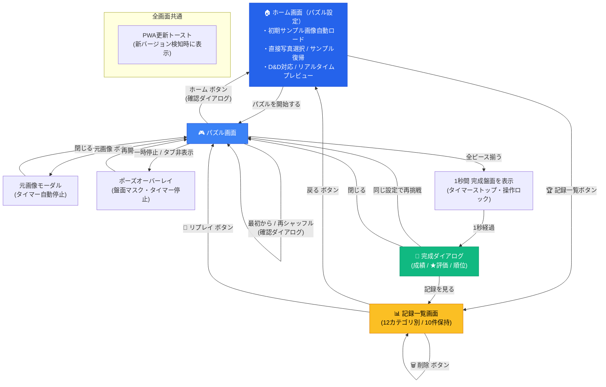

# App Slide Puzzle Lab 要件定義書

| 項目 | 内容 |
| --- | --- |
| 文書バージョン | 1.1 |
| 作成日 | 2026-09-23 |
| 最終更新日 | 2026-09-30 |
| 対象 | v1.1.0 |
| アプリ形態 | 完全ローカルで動作するWebアプリ／PWA |

## 改訂履歴

| バージョン | 改訂日 | 改訂者 | 改訂内容 |
| --- | --- | --- | --- |
| 0.1 | 2026-09-23 | - | 初版作成 |
| 0.2 | 2026-09-24 | - | レビュー精査に基づく推奨案・推奨方針の反映（空白マス右下固定、ピース番号表示、Exif回転補正、1024px縮小、ポーズ仕様、操作性向上等） |
| 1.0 | 2026-09-24 | - | **正式初版（v1.0.0）としての仕様確定と最短手数表示・UI/UX最適化の反映**： ・完成時演出の改善（完成直後タイマー停止・操作ロック、1秒間完成盤面表示後にお祝いダイアログ表示、盤面の空白マス維持） ・パズル盤面プレビューおよび画像選択パネルの正方形（1:1）およびパズル盤面デザインの統一 ・PWA完全対応（高解像度アプリアイコン群、iOS Safari用PWAメタタグ、ノッチ対応） ・最短手数表示機能（3×3双方向BFS・4×4 IDA*による厳密解探索、3秒上限、マンハッタン距離下限表示、Web Worker非同期化） |
| 1.1 | 2026-09-30 | - | **記録・ランキング＆リプレイ機能の実装およびホーム画面化・UI/UX改善**： ・**記録・ランキング機能**: 分割数×シャッフル度の全12カテゴリごとに上位10件をlocalStorageに保持、最短手数比率に基づく★評価（★★★〜☆☆☆）の算出 ・**同一盤面リプレイ機能**: 過去の記録から同一画像・同一初期配置で再挑戦できるリプレイ機能の実装 ・**記録一覧画面**: サイズ・シャッフル度フィルター、順位・メダル・★評価・記録詳細表示、および各記録の個別削除機能（🗑️）の追加 ・**画面遷移の見直し（ホーム画面化）**: パズル設定画面をホーム画面として再定義。起動時にサンプル画像を自動読み込みし、画面上で直接写真選択・サンプル復帰・ドラッグ＆ドロップができるUIへ刷新 ・**操作バーの改善**: プレイ画面の「設定変更」を「ホーム」ボタン（Homeアイコン）に見直し ・**ツールチップ導入**: Tailwind CSSベースの軽量カスタム `Tooltip` コンポーネントを導入し、主要ボタンに配置 ・**レスポンシブ・スクロール改善**: 共通モーダルの `max-height` 制限と縦スクロール対応、完成ダイアログの余白最適化、ルートコンテナのスクロール見切れ防止 ・**アプリアイコン統一**: ホーム画面ヘッダー左上のアイコンをファビコン（`favicon.svg`）と同じスライドパズルデザインへ統一 |

---

## 1. 概要

### 1.1 目的

利用者が端末内の写真や画像を取り込み、複数のピースに分割されたスライドパズルとして、通信を必要とせずに安心して楽しめるWebアプリを提供する。

### 1.2 背景

一般的なスライドパズルは、1マスを空白にした盤面上で、その空白に隣接するピースを移動し、分割された画像を元の1枚の絵に戻すゲームである。本アプリでは、利用者自身の画像を使用できること、分割数およびシャッフルの度合いを個別に選べること、自己ベストを記録・比較・リプレイできること、そして完全ローカルかつオフライン（PWA）で軽快に動作することを特徴とする。

### 1.3 基本方針

- 画像の選択、加工、パズル生成、プレイ、完成判定、過去記録管理のすべての処理を端末（ブラウザ）内で完結させる。
- 選択した画像を外部サーバーへ一切送信しない。
- 初回の読み込み後は、完全オフライン環境（機内モード等）でも利用できるPWAとする。
- ホーム画面（設定画面）を開けばすぐに初期サンプル画像でパズルを開始できるシームレスな動線を提供する。
- スマートフォンでのタッチ・スワイプ操作を優先し、PCのマウスおよびキーボード操作にも完全対応する。
- 生成する盤面は数学的に必ず完成可能とする。
- 難易度は「分割数」と「シャッフルの度合い」の2軸で設定できるようにし、視認性補助として「ピース番号表示」を提供する。
- カテゴリ別のハイスコア記録と、過去の好記録と全く同じ配置に再挑戦できるリプレイ機能を提供する。

---

## 2. 対象範囲

### 2.1 本バージョン（v1.1）に含まれる機能

- **ホーム画面（パズル設定・画像変更統合）**:
  - アプリ起動時の自動初期表示（サンプル画像 `/sample.jpg` を自動ロード済）
  - ファビコン（`favicon.svg`）と統一されたアプリアイコンと「完全ローカル」安心バッジ
  - 端末内の写真選択（JPEG、PNG、WebP対応）ボタンおよび即座のプレビュー切り替え
  - サンプル画像への復帰ボタン
  - PC環境でのプレビュー枠への画像ドラッグ＆ドロップ対応
  - Exif回転情報の自動補正、透過画像の自動白背景マット合成、長辺最大1024pxへの自動リサイズ最適化
  - ドラッグによるパン位置移動、ズームスライダー（1.0〜2.5倍、余白なし制約）
  - パズル盤面と同一の角丸（3px相当）、隙間、立体エッジ、右下空白マス破線、番号連動を再現したリアルタイムプレビュー
  - 分割数セレクター（3×3、4×4、5×5、6×6）
  - シャッフル度合いセレクター（軽め、標準、強め）
  - ピース番号表示切り替えスイッチ
  - 過去の記録一覧画面への遷移ボタン（🏆）
- **完成保証盤面の生成**:
  - 右下端を空白マスとした完成可能配置の生成（合法手逆行防止シミュレーション）
  - シャッフル終了時の崩れ度合い検証（難易度レベルに応じた正解位置残存比率判定、最大20回再試行）
- **直感的なピース操作**:
  - タップ / クリックによるピース移動
  - 20〜30px閾値のスワイプ / フリックによるピース移動
  - キーボード操作（空白方向へピース移動、操作ガイド表示）
  - 80〜120msの軽快なアニメーションと先行入力追従
- **計測・一時停止・元画像確認**:
  - 手数および経過時間のリアルタイム計測
  - 手動ポーズ（盤面マスク）およびブラウザバックグラウンド移行時の自動ポーズ
  - 元画像モーダル確認（確認中はタイマー自動一時停止）
- **最短手数表示（Web Worker非同期探索）**:
  - 初期配置スナップショットに対する最短手数の算出・表示
  - 3×3（双方向BFS）および4×4（IDA*）の厳密解探索（上限 3,000ms）
  - 5×5・6×6および3秒タイムアウト時の空白除外マンハッタン距離による下限表示（`最短 XX手以上`）
  - UIスレッド完全非同期化（ゲーム操作を一切妨げない）
  - ヘッダーおよびクリア完成ダイアログでの結果表示
- **操作バー動線**:
  - 「元画像」: 完成見本画像を拡大表示（タイマー一時停止）
  - 「最初から」: 現在の初期配置へリセット（手数・時間0、最短手数再利用）
  - 「再シャッフル」: 同じ設定で別の崩れ方の盤面を新しく生成
  - 「ホーム」: ホーム画面（設定・画像変更）に戻る
  - プレイ途中リセット時の誤操作防止確認ダイアログ
- **完成判定と演出**:
  - 全ピース揃い時の完成判定
  - タイマー即時停止およびピース移動ロック
  - **完成直後は1秒間完成盤面を表示**（余韻の確保）
  - **1秒後にクリア完成ダイアログを表示**（成績カード、最短手数、★評価、ランキング順位、新記録バッジ、再挑戦、記録一覧、閉じる）
  - ダイアログを閉じた後も**空白マスは欠落した状態（本来のパズル盤面）のまま表示**（移動不可）
- **記録（ランキング）・リプレイ機能**:
  - 分割数×シャッフル度の全12カテゴリごとに上位10件をlocalStorageに保持
  - 最短手数比率に基づく★評価（★★★〜☆☆☆）の算出・表示
  - ソート規則: ①★評価降順 → ②手数昇順 → ③経過時間昇順 → ④日時降順
  - 完成時の多重保存防止ガード（1ゲームにつき1回のみ確実に保存）
  - **記録一覧画面**: カテゴリ別絞り込み、順位（🥇🥈🥉）、タイム、手数（最短手数）、日付、リプレイボタン、個別削除ボタン（🗑️）
  - **同一盤面リプレイ**: 保存された初期配置（`initialBoard`）を復元し、同一画像・同一設定・完全に同一のシャッフル配置で再挑戦
- **UI/UXコンポーネント**:
  - Tailwind CSSベースの軽量カスタム `Tooltip` コンポーネント（主要操作ボタンに表示）
  - レスポンシブ縦スクロール対応モーダル（`max-h` 制限 ＆ `overflow-y-auto`）
  - 余白を最適化したコンパクトな完成ダイアログ
- **PWA・オフライン対応**:
  - 高解像度アプリアイコン完備、iOS Safari向けPWA全画面メタタグ、ノッチ対応
  - 完全オフライン（Service Worker）起動・動作
  - PWA更新通知トースト

### 2.2 対象外の機能（将来拡張候補）

- ユーザーアカウント登録、ログイン
- サーバーへの画像・記録の保存・外部通信
- オンラインランキング、対戦、SNS直接共有
- 複数画像の端末内アルバム管理
- 自動解答（オートプレイ）AI

---

## 3. 想定利用者と利用環境

### 3.1 想定利用者

- 手持ちの写真やイラストを使って自分だけのパズルを気軽に楽しみたい人
- 過去の記録を更新したり、同じパズルに何度でも挑戦したい人
- 通信やアカウント登録なしでプライバシーを保って安心して遊びたい人
- スマートフォン、タブレット、PCの幅広い層の利用者

### 3.2 対象環境

- **スマートフォン・タブレット**: iOS Safari（最新および1世代前）、Android Chrome
- **PC**: Google Chrome、Microsoft Edge、Safari、Firefox
- JavaScript および localStorage が有効であること
- PWA（ホーム画面に追加）機能が利用可能であること

---

## 4. ユースケース

### UC-01 パズルを開始・設定する（ホーム画面）
1. アプリを開くと、ホーム画面にサンプル画像とパズルプレビューが表示される。
2. そのまま「パズルを開始する」を押せば、すぐにサンプル画像のパズルが開始される。
3. 画像を変えたい場合、「写真を選ぶ」を押して端末内の画像を選択するか、プレビュー枠に画像ファイルをドロップする。
4. いつでも「サンプル」を押せば、初期のサンプル画像に戻すことができる。
5. 必要に応じてドラッグやズームスライダーで正方形切り抜き位置を調整する。
6. 分割数（3×3〜6×6）、シャッフル度合い（軽め・標準・強め）、ピース番号表示（ON/OFF）を選び、「パズルを開始する」を押下する。
7. アプリが完成可能な崩れた初期盤面を生成し、パズル画面を表示してタイマーを開始する。

### UC-02 パズルをプレイする
1. 空白に隣接するピースをタップするか、空白方向へスワイプ、または矢印キーを押下する。
2. ピースが空白マスへスムーズに移動し、手数が1加算される。
3. プレイ中もヘッダーの「＃」ボタンでピース番号の表示/非表示を即座に切り替えられる。

### UC-03 元画像を確認する
1. 操作バーの「元画像」ボタンを押下する。
2. タイマーが一時停止し、元画像がモーダルで大きく表示される。
3. モーダルを閉じると、タイマーが再開して元のプレイ画面に戻る（手数は不変）。

### UC-04 一時停止（ポーズ）する
1. ヘッダーの「一時停止」ボタンを押す、またはブラウザの別タブへ切り替える。
2. タイマーが停止し、盤面がマスクされてポーズ画面が表示される。
3. 「再開」ボタンを押すと、盤面マスクが解除されてタイマーが再開する。

### UC-05 やり直す・ホーム画面に戻る
- 「最初から」: 開始時の初期盤面に戻し、手数と時間をリセットする。
- 「再シャッフル」: 同じ設定で別の崩れ方の盤面を新しく生成する。
- 「ホーム」: ホーム画面に戻り、画像や設定を再調整できる（プレイ途中の場合は確認ダイアログを表示）。

### UC-06 パズルを完成する・記録を確認する
1. 最後のピースを動かして全ピースが正解位置に揃う。
2. 直ちにタイマーが停止し、ピース移動がロックされる。
3. 完成した盤面が1秒間そのまま表示される。
4. 1秒後、完成ダイアログが表示される（総手数、クリア時間、最短手数、★評価、ランキング順位、新記録バッジ）。
5. 利用者は以下のいずれかを選択できる：
   - 「同じ設定で再挑戦」: 新しいシャッフル盤面で再度プレイ
   - 「記録を見る」: 記録一覧画面を開いて過去の記録を確認
   - 「閉じる」: ダイアログを閉じ、完成した盤面（右下は空白のまま）を確認

### UC-07 過去の記録からリプレイする
1. ホーム画面の「🏆」ボタン、または完成ダイアログの「記録を見る」ボタンから記録一覧画面を開く。
2. ドロップダウンでサイズとシャッフル度を選択し、過去の記録一覧（最大10件）を確認する。
3. 記録カードの「🔁（リプレイ）」ボタンを押下する。
4. その記録が達成された時と**完全に同一の初期配置（パズル盤面）・同一設定**でパズル画面が立ち上がり、再挑戦できる。
5. 不要な記録は「🗑️（削除）」ボタンでいつでも個別削除できる。

---

## 5. 画面構成とUI仕様

| 画面・コンポーネント | UI仕様・役割 |
| --- | --- |
| **ホーム画面（パズル設定）** | ・アプリタイトル「Slide Puzzle Lab」、ファビコンと統一されたアプリアイコン、完全ローカル安心バッジ ・**パズル盤面完全再現プレビュー**（正方形、`bg-slate-800/95`、角丸、隙間、立体エッジ、空白破線枠、番号連動） ・ドラッグパン位置調整 ＆ ズームスライダー ・画像変更ボタン群：[📷 写真を選ぶ] [🔄 サンプル] ・PC用ドラッグ＆ドロップ対応 ・分割数セレクター（3×3〜6×6） ・シャッフル度合いセレクター（軽め・標準・強め） ・ピース番号表示スイッチ ・アクションボタン：[パズルを開始する]、[🏆 記録一覧（ツールチップ付き）] |
| **パズル画面** | ・ヘッダー（手数、時間、一時停止ボタン、ピース番号切替ボタン、**最短手数表示バッジ**、各ボタンにツールチップ付与） ・**パズル盤面**（アスペクト比1:1、ダークスレート外枠、角丸ピース、立体シャドウ、空白マス） ・**操作バー（4ボタン均等配置・ツールチップ付き）**：[元画像] [最初から] [再シャッフル] [ホーム] ・PC用キーボード操作ガイド |
| **記録一覧画面** | ・戻るボタン（ホームへ戻る） ・サイズ（3×3〜6×6）＆シャッフル度（軽め〜強め）選択ドロップダウン ・記録リスト（順位・メダル 🥇🥈🥉、★評価、クリア時間、手数、最短手数、日付、[🔁 リプレイ]、[🗑️ 削除]） ・空状態メッセージ |
| **元画像モーダル** | ・完成見本画像を拡大表示するモーダル（表示中タイマー自動停止） |
| **ポーズオーバーレイ** | ・盤面マスク、経過時間、再開ボタン（手動ポーズ＆バックグラウンド検知連動） |
| **完成ダイアログ** | ・トロフィーアイコン、お祝いメッセージ ・完成画像プレビュー ・★評価表示（★★★〜☆☆☆） ・成績カード（総手数、クリア時間、最短手数） ・ランキング順位（例: 「ランキング: 1位」「🎉 新記録達成！」） ・アクションボタン：[同じ設定で再挑戦]、[記録を見る]、[閉じる（パズル画面に戻る）] ・小型画面でも上下が切れない縦スクロール（`max-h` + `overflow-y-auto`）対応 |
| **ツールチップ (`Tooltip`)** | ・ホバーおよびキーボードフォーカス時に表示される半透明ダークトーン吹き出し（三角矢印付き、アニメーション150ms） |
| **確認ダイアログ** | ・最初から、再シャッフル、ホームに戻る際の進行破棄防止ダイアログ |
| **PWA更新トースト** | ・画面右下に表示される控えめな更新通知バナー（更新ボタン・閉じるボタン） |

---

## 6. 機能要件詳細

### FR-01 ホーム画面とシームレスな画像管理
- **初期表示**: アプリ起動時に初期画面として表示。`/sample.jpg` を自動読み込みし、初回から設定プレビューが表示された状態で待機する。
- **写真選択**: `[写真を選ぶ]` ボタンから端末内画像（JPEG、PNG、WebP）を選択可能。
- **ドラッグ＆ドロップ**: プレビュー枠に直接画像ファイルをドロップして差し替え可能（ドラッグオーバー時のハイライト表示）。
- **サンプル画像復帰**: `[サンプル]` ボタンを押すことで、いつでも初期サンプル画像に差し替え可能。
- **画像前処理**:
  - Exif Orientation の自動回転補正
  - アルファチャンネル透過画像の白背景（#FFFFFF）自動マット合成
  - 長辺最大1024pxへの自動リサイズ最適化
  - 境界丸め（`Math.round`）による端数欠落・隙間ゼロのピーススライス処理

### FR-02 正方形クロップとリアルタイムプレビュー
- クロップ枠は正方形（アスペクト比 1:1、出力1024×1024px）固定とし、余白（レターボックス）を生じさせない。
- マウスドラッグまたはタッチドラッグによるパン位置移動、スライダーによるズーム（1.0〜2.5倍）をサポート。
- プレビュー枠は実際のパズル盤面と全く同一の角丸（3px相当）、隙間、立体エッジ、右下空白マス破線、番号連動を描画する。

### FR-03 難易度設定と補助表示
- **分割数**: 3×3（8ピース）、4×4（15ピース、初期値）、5×5（24ピース）、6×6（35ピース）
- **シャッフルの度合い**:
  - 軽め（総マス数 × 3 ステップ、正解位置50〜80%目安）
  - 標準（総マス数 × 10 ステップ、初期値、正解位置20〜50%目安）
  - 強め（総マス数 × 30 ステップ、正解位置0〜35%目安）
- **ピース番号表示**: 各ピースに正解インデックス番号（1〜N-1）を表示（空白マスには非表示）。ホーム画面およびパズル画面ヘッダーでいつでも即時切替可能。

### FR-04 盤面生成とシャッフル保証
- 完成状態（空白マスは右下端）から開始し、空白マスに隣接する合法手のみをランダムに適用して**100%可解（必ず解ける）**盤面を生成する。
- 直前の手と真逆の即時戻り移動は除外する。
- 終了時に難易度ごとの正解位置残存比率（軽め: 80%以下、標準: 50%以下、強め: 35%以下）を満たすまで最大20回再試行する。

### FR-05 ピース操作とアニメーション
- **タップ/クリック**: 空白マスに隣接するピースをタップ・クリックすると空白マスへ移動。
- **スワイプ/フリック**: 移動量20px以上のスワイプで空白方向へ移動。Pointer Events によりタップと分離し、合成クリック二重実行を抑止。
- **キーボード**: 矢印キーで空白方向へピース移動。
- **操作禁止の一元ガード**: ポーズ中、元画像確認中、ダイアログ表示中、完成後は全操作が無効化される。
- **アニメーション**: 80〜120msの軽快な移動アニメーション（`prefers-reduced-motion` 有効時は0ms）。

### FR-06 手数・時間・ポーズ・ホーム復帰
- 手数（有効移動ごとに+1）と経過時間（秒単位）を常時表示。
- 元画像確認中、手動ポーズ中、ブラウザタブ非表示時（`visibilitychange`）はタイマーを自動一時停止。
- 操作バーの「ホーム」ボタンから、進行中パズルの確認ダイアログを経てホーム画面へ戻ることができる。

### FR-07 最短手数表示（Web Worker非同期探索）
- 初期配置スナップショットに対して Web Worker で非同期探索。
- 3×3（双方向BFS）および4×4（IDA*）の厳密解探索（3,000ms上限）。
- 5×5・6×6およびタイムアウト時は空白除外マンハッタン距離による下限表示（`最短 XX手以上`）。
- 画面離脱・再シャッフル時は実行中 Worker を安全に terminate。

### FR-08 記録（ランキング）・★評価・リプレイ機能
- **保存キー**: localStorage `slide_puzzle_records`
- **カテゴリ管理**: 分割数（3〜6）× シャッフル度（軽め/標準/強め）の全12カテゴリごとに独立して最大10件を保持。
- **データ構造 (`PuzzleRecord`)**:
  - `id`: 一意識別子（UUID）
  - `timestamp`: 達成日時（ミリ秒）
  - `gridSize`: 分割数（3〜6）
  - `shuffleLevel`: シャッフル度（'light' \| 'standard' \| 'hard'）
  - `initialBoard`: 初期タイル配置配列（`number[]`）
  - `moves`: クリア総手数
  - `elapsedTime`: クリア所要秒数
  - `shortestMoves`: 最短手数（確定値または下限値）
  - `rating`: ★評価（0〜3）
- **★評価基準（最短手数比率）**:
  - 3つ星（★★★）: 手数 $\le$ 最短手数（1.0倍以下、パーフェクト）
  - 2つ星（★★☆）: 手数 $\le$ 最短手数 × 1.5（優秀）
  - 1つ星（★☆☆）: 手数 $\le$ 最短手数 × 2.5（良い）
  - 0つ星（☆☆☆）: 手数 $> 2.5$ 倍（完成）
- **ソート・順位判定**:
  1. `rating` 降順（星が多い順）
  2. `moves` 昇順（手数が少ない順）
  3. `elapsedTime` 昇順（時間が短い順）
  4. `timestamp` 降順（新しい記録順）
- **多重保存防止**: 1回の完成につき確実に1度だけ保存するガード機構を実装。
- **リプレイ機能**: 記録一覧の「🔁」ボタンから、保存されている `initialBoard` を復元して同一パズルを即座に再プレイ可能。
- **個別削除機能**: 各記録カードの「🗑️」ボタンから不要な記録を個別に削除可能。

### FR-09 レスポンシブ＆スクロール対応
- 共通モーダル（`Modal.tsx`）に `max-h-[calc(100dvh-2rem)]` および `overflow-y-auto` を設定し、どんな解像度・画面サイズでもモーダル内がスムーズに縦スクロール可能。
- 完成ダイアログの余白と画像サイズを最適化し、標準的なPCやスマホ画面で縮小なしで全要素が収まるレイアウト。
- ルートコンテナの縦スクロール見切れを解消。

### FR-10 ツールチップ表示
- Tailwind CSS による軽量カスタム `Tooltip` コンポーネント。
- マウスホバーおよびキーボードフォーカス時に、滑らかなフェードインアニメーションと三角矢印付きで表示。
- 対象: 🏆記録ボタン、番号トグル、一時停止ボタン、下部操作バー各ボタン、戻るボタン、リプレイボタン、削除ボタン。

### FR-11 PWAとオフラインキャッシュ
- `manifest.webmanifest` による PWA インストール対応。
- アプリアイコン: 192px、512px、マスカブル512px、Apple Touch 180px、Favicon 48px / SVG。
- Workbox による全アセットの事前キャッシュで完全オフライン起動・動作を保証。

---

## 7. 画面遷移図

---

## 8. 非機能要件

- **完全ローカル・プライバシー保護**: 選択画像・パズル盤面・プレイ記録はすべて端末内（メモリ / localStorage）で完結し、外部サーバーへの通信は一切発生しない。
- **パフォーマンス**: 画像最適化処理 1秒以内、ピース移動レスポンス 16ms以内（60fps）、初期表示即時性。
- **操作性**: スマホ片手操作・スワイプ閾値20px、Pointer Eventsによるタップ・スワイプ二重実行抑止、ツールチップによる操作補助。
- **アクセシビリティ**: キーボード操作（矢印キー、Tab循環、Escape閉じ）、WAI-ARIA準拠（`role="dialog"`, `role="tooltip"`, `role="switch"`, `aria-label`）、高コントラスト番号バッジ、`prefers-reduced-motion` 対応。
- **堅牢性**: 完成時記録の多重保存防止、画面リサイズ時のスクロール対応、先行入力追従、タブ切り替え時の状態保護。

---

## 9. 受入条件（Acceptance Criteria）

- [x] **AC-01**: ホーム画面起動時に初期サンプル画像が自動展開され、設定変更や即時プレイ開始が可能なこと。
- [x] **AC-02**: ホーム画面上で「写真を選ぶ」から端末内画像を選択、またはドラッグ＆ドロップで画像を直接差し替えられること。いつでも「サンプル」ボタンで初期画像に戻せること。
- [x] **AC-03**: パズル盤面プレビューが実際のパズル盤面と同一の正方形比率・角丸・隙間・質感・番号連動で描画されること。
- [x] **AC-04**: 3×3〜6×6の分割数、軽め〜強めのシャッフル度、ピース番号表示の切替が正常に機能すること。
- [x] **AC-05**: 生成盤面が常に完成可能であり、タップ・スワイプ・キーボードで軽快に操作できること。
- [x] **AC-06**: 最短手数が初期配置に対して算出され、確定値または下限値が表示されること。
- [x] **AC-07**: パズル画面の操作バー「ホーム」ボタンから確認ダイアログを経てホーム画面へ戻れること。
- [x] **AC-08**: パズル完成時にタイマーが即時停止し、1回のみ正確に記録が保存されること。1秒後に完成ダイアログが表示され、★評価およびランキング順位が表示されること。
- [x] **AC-09**: 記録一覧画面でサイズ×シャッフル度ごとに上位10件が閲覧でき、各記録から同一配置でリプレイできること。また、個別削除が可能なこと。
- [x] **AC-10**: 主要ボタンにツールチップが表示されること。
- [x] **AC-11**: 画面サイズが小さい場合でもモーダルや画面全体のスクロールによりボタン等の操作要素が欠落しないこと。
- [x] **AC-12**: PWAとして完全オフラインで起動・プレイできること。

---

## 10. 実装技術構成

- **フロントエンド**: React 19, TypeScript, Vite 6
- **スタイリング**: Tailwind CSS
- **アイコン**: Lucide React
- **PWA**: `vite-plugin-pwa`, Workbox
- **テスト**: Vitest, React Testing Library, JSDOM
- **CI**: GitHub Actions (Node 22 LTS, npm ci, test, build)
- **デプロイ・ホスティング**: Vercel (Production) / GitHub
