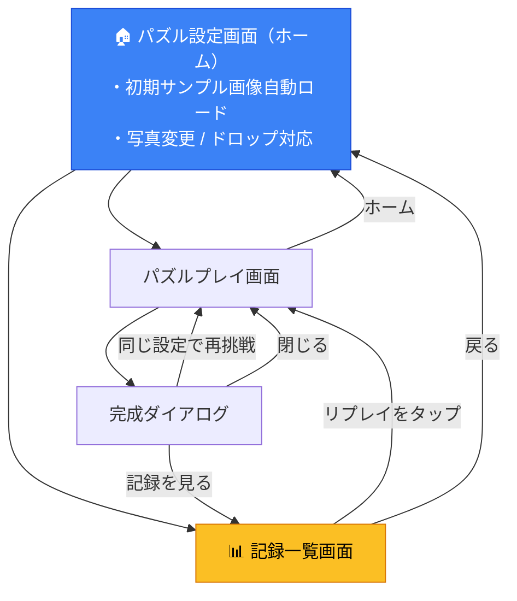

# 🏆 記録（ランキング）& リプレイ機能 — 仕様書

## 1. 機能概要

パズル完成時の記録を **分割数（GridSize）× シャッフル度（ShuffleLevel）** ごとに保存・表示し、
過去の記録から **完全に同じ配置のパズル** に再挑戦できるようにする。

---

## 2. 現状と仕様概要

| 項目 | 仕様 |
|---|---|
| 分割数 | `GridSize = 3 | 4 | 5 | 6` (4種) |
| シャッフル度 | `ShuffleLevel = 'light' | 'standard' | 'hard'` (3種) |
| カテゴリ数 | 4 × 3 = **12カテゴリ** |
| シャッフル方式 | `Math.random()` によるランダム移動（シード無し） |
| リプレイの手がかり | `initialBoard: number[]` にシャッフル後の初期タイル配置が保存済み |
| 記録の保存 | 実装済み — `localStorage`（キー: `slide_puzzle_records`）にカテゴリ別配列で保存 |
| スコア指標 | `moves`（手数）、`elapsedTime`（経過秒）、`shortestMoves`（最短手数）、`rating`（★評価）、`shortestMovesKind`（根拠） |

> [!IMPORTANT]
> シャッフルに乱数シードが無いため、「同じパズルの再現」には **`initialBoard`（初期タイル配置のインデックス配列）を保存** して再利用します。
> 画像は記録ごとに保存せず、リプレイ時は現在選択されている画像を使用して同じ初期配置を再現します。

---

## 3. データ設計

### 3.1 記録データ型

```typescript
/** 1件の記録 */
export interface PuzzleRecord {
  id: string;                    // 一意ID（crypto.randomUUID()）
  timestamp: number;             // 記録日時（Date.now()）
  
  // ── パズル設定 ──
  gridSize: GridSize;
  shuffleLevel: ShuffleLevel;
  
  // ── 初期配置（リプレイ用） ──
  initialBoard: number[];        // シャッフル後の初期タイル配置（例: [1, 2, 3, 4, 5, 0, 7, 8, 6]）
  
  // ── 成績 ──
  moves: number;                 // 実際の手数
  elapsedTime: number;           // 経過時間（秒）
  shortestMoves: number;         // 最短手数（厳密解または下限値）
  rating: number;                // ★評価（0〜3）
  
  // ── 評価の根拠 ──
  shortestMovesKind?: 'exact' | 'lower_bound' | 'unknown'; // 最短手数の根拠種別
}

/** カテゴリキーの生成ヘルパー */
export type RecordCategoryKey = `${GridSize}-${ShuffleLevel}`;
// 例: "3-light", "4-standard", "6-hard"
```

### 3.2 localStorage キー設計

```
slide_puzzle_records          // 全記録をJSON保存
```

内部構造:

```typescript
type RecordsStore = Record<RecordCategoryKey, PuzzleRecord[]>;

// 例:
{
  "3-light":      [ record1, record2, ... ],  // ★順にソート（最大10件）
  "3-standard":   [ ... ],
  "4-hard":       [ ... ],
  ...
}
```

### 3.3 保存上限と容量対策

| 設定 | 値 | 理由 |
|---|---|---|
| カテゴリあたり最大件数 | **10件** | 12カテゴリ × 10件 = 全体最大120件 |
| ソートキー（ランク順） | **① ★評価（降順）→ ② 手数（昇順）→ ③ 経過時間（昇順）→ ④ 日時（降順）** | 少ない手数・速い時間が上位 |
| 画像データの保存 | 保存しない | localStorage容量節約のため盤面配列のみ保存 |

### 3.4 後方互換性と正規化

- `shortestMovesKind` が存在しない旧データは、読み込み時に `unknown` として正規化して扱います。
- 旧記録の分割数だけで `exact` と推定することはしません（3×3 / 4×4 でもタイムアウト等により下限値へフォールバックしている可能性があるため）。
- 読み込み時に `localStorage` を直接書き換える一括マイグレーションは行わず、通常の新規記録保存時に正規化されたデータが書き戻されます。
- `getRecords`、`getRecordById` などの読み込み関数は同一の正規化処理を使用します。

---

## 4. 画面設計

### 4.1 画面遷移フロー



### 4.2 記録一覧画面のUI設計

#### 画面レイアウト

```
┌─────────────────────────────────────┐
│  ← 戻る          🏆 記録一覧         │
├─────────────────────────────────────┤
│                                     │
│  ┌──────────┐  ┌──────────────────┐ │
│  │ 分割数   │  │ シャッフル度     │ │
│  │ [3×3 ▼]  │  │ [標準 ▼]         │ │
│  └──────────┘  └──────────────────┘ │
│                                     │
│  ─── 3×3 ・ 標準 の記録 ─────────── │
│                                     │
│  ┌─────────────────────────────────┐│
│  │ 🥇  1.  ★★★  12手  00:45      ││
│  │         (最短10手)              ││
│  │     2026/09/28              🔁 ││
│  ├─────────────────────────────────┤│
│  │ 🥈  2.  ★★☆（参考） 18手 01:12 ││
│  │         (最短15手以上)          ││
│  │     2026/09/25              🔁 ││
│  ├─────────────────────────────────┤│
│  │ 🥉  3.  ★★☆（参考） 20手 01:30 ││
│  │         (最短15手（未確認）)    ││
│  │     2026/09/20              🔁 ││
│  └─────────────────────────────────┘│
│                                     │
│  まだ記録がありません（空の場合）   │
│                                     │
└─────────────────────────────────────┘
```

#### 各記録行の表示要素

| 要素 | 内容 |
|---|---|
| 順位 | 1〜10（🥇🥈🥉は上位3位） |
| ★評価 | ★★★ / ★★☆ / ★☆☆ / ☆☆☆（下限値または未確認の場合は星の横に「（参考）」を明示） |
| 手数 | `{moves}手`（最短手数は保存された根拠に応じて `(最短N手)` / `(最短N手以上)` / `(最短N手（未確認）)` と表示） |
| 経過時間 | `MM:SS` または `HH:MM:SS` |
| 日付 | `YYYY/MM/DD` |
| 🔁 ボタン | 「この配置（同じパズル）で再挑戦」— タップでリプレイ開始 |
| 🗑️ ボタン | 記録の削除 |

### 4.3 完成ダイアログの表示

- 厳密解確定時（`exact`）：通常の評価ラベル（例：「パーフェクト！」「優秀！」）
- 下限値確定時（`lower_bound` または `unknown`）：既存の評価ラベルに「（参考）」を付与（例：「パーフェクト！（参考）」）
- 最短手数テキスト（`shortestMovesText`）：探索時間を含め、既存の表示（例：`最短 15手（0.5秒）` や `最短 20手以上（3.0秒）`）をそのまま維持

---

## 5. リプレイ機能の仕様

### 5.1 仕組み

1. 記録一覧で 🔁 をタップ
2. 記録の `initialBoard` と設定（`gridSize`, `shuffleLevel`）を取得
3. **通常のシャッフル処理をスキップ**し、`initialBoard` をそのままパズルの初期状態として設定
4. パズルプレイ画面を開始（画像は現在設定中の画像を使用）

### 5.2 実装方針

`usePuzzleGame` フックの `replayInitialBoard` オプション:

```typescript
interface UsePuzzleGameProps {
  gridSize: GridSize;
  shuffleLevel: ShuffleLevel;
  initialShowNumbers: boolean;
  isInteractionDisabled?: boolean;
  replayInitialBoard?: number[];   // 指定時はシャッフルをスキップし初期盤面として使用
  onMoveSuccess?: () => void;
  onCompleted?: () => void;
}
```

- `replayInitialBoard` が渡された場合:
  - `shuffleBoard()` を呼ばず、`replayInitialBoard` を初期配置として使用
  - 最短手数の計算は初期配置を基準に通常通り実行
- 完成時は通常と同じく記録保存

---

## 6. 最短手数・評価の算出基準と根拠

### 6.1 最短手数の計算アルゴリズムとフォールバック

- **3×3 / 4×4**: Web Worker上でIDA*アルゴリズムによる探索を実行（制限時間3秒）。
  - 探索成功時: 厳密解（`exact`）
  - 3秒タイムアウト時: マンハッタン距離＋線形コンフリクトによる下限値（`timeout` → `lower_bound`）
  - Web Worker非対応環境・エラー発生時: 下限値（`error` → `lower_bound`）
- **5×5 / 6×6**: 状態空間が膨大で短時間での厳密解探索が不可能なため、探索を行わずマンハッタン距離による下限値を即時使用（`lower_bound`）。

### 6.2 ★評価（レーティング）の算出基準

★評価は **プレイヤーの手数が最短手数（または下限値）にどれだけ近いか**（手数効率）で判定します。

| 評価 | 条件 | 意味 |
|---|---|---|
| ★★★ | `moves ≤ shortestMoves × 1.0` | **パーフェクト** |
| ★★☆ | `moves ≤ shortestMoves × 1.5` | **優秀** |
| ★☆☆ | `moves ≤ shortestMoves × 2.5` | **良い** |
| ☆☆☆ | `moves > shortestMoves × 2.5` | **完成** |

分母（`shortestMoves`）が0以下・NaN・Infinityの場合や、無効な手数の場合は安全ガードとして星0を返します。

### 6.3 下限値による評価の特性と参考評価の扱い

- 下限値（マンハッタン距離など）は、数学的に **真の最短手数以下** の値となります（$h(s) \le h^*(s)$）。
- したがって、同じ計算式（`moves / shortestMoves`）を適用した場合、分母が真の最短手数よりも小さくなるため、倍率は真の倍率より大きくなります。
- すなわち、**厳密解基準に比べて評価（星の獲得）は同じか厳しくなる** 特性があります（過去の仕様書にあった「やや甘め」という記述は誤り）。
- そのため、下限値による星評価は **「参考評価」** として明示し、ユーザーに下限値基準であることを伝えます。下限値に対する恣意的な補正係数は導入しません。
- 根拠ごとのカテゴリ分割やフィルターは行わず、**厳密解と参考評価が同じランキングに混在** します。

### 6.4 表示方針の決定基準

- 表示文字列（「以上」が含まれるかどうか等）に依存して表示を切り替えるのではなく、**レコードに保存された `shortestMovesKind`（根拠フィールド）に基づいて決定** します。
  - `exact`: 通常の星評価、`(最短N手)`
  - `lower_bound`: 星評価に「（参考）」、`(最短N手以上)`
  - `unknown`: 星評価に「（参考）」、`(最短N手（未確認）)`

### 6.5 完成時の保存タイミング制御

- 最短手数の非同期計算中にパズルが完成した場合、計算完了（`exact` または `lower_bound` / `timeout` / `error` の確定）を待ってから1度だけ保存します。
- 保存時には、計算完了時点のタイマー値ではなく、**パズル完成時点に確定保持されたクリア時間**（`finalTimeRef`）が保存されます。
