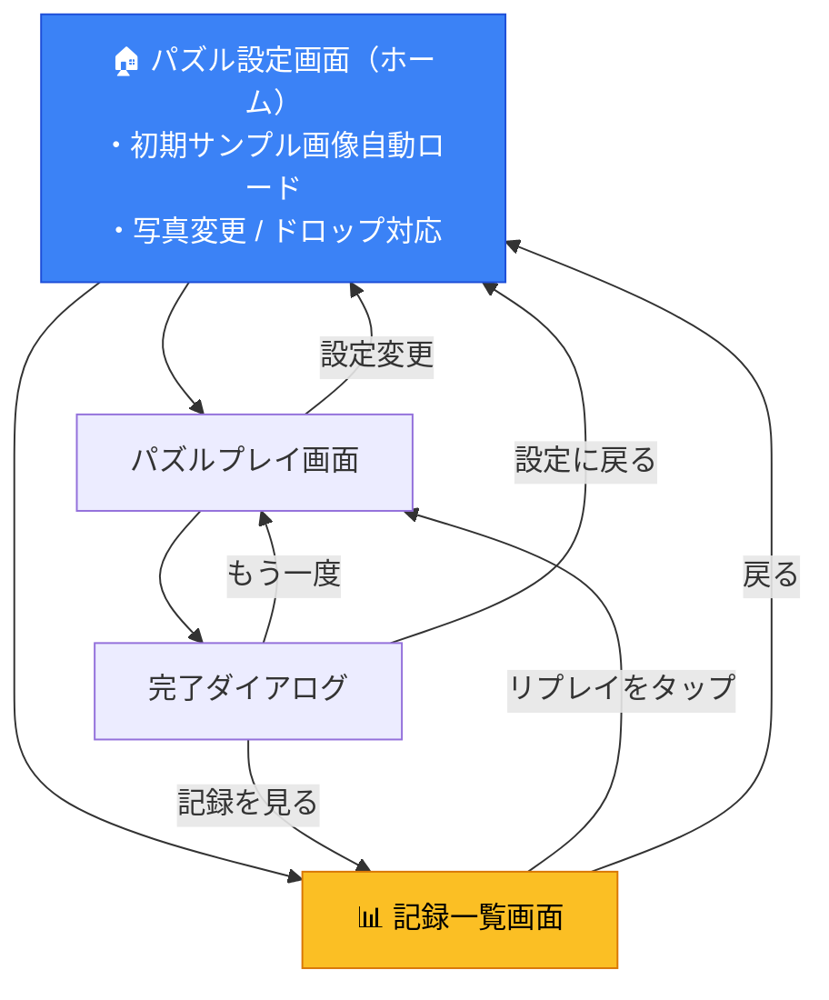

# 🏆 記録（ランキング）& リプレイ機能 — 仕様書

## 1. 機能概要

パズル完成時の記録を **分割数（GridSize）× シャッフル度（ShuffleLevel）** ごとに保存・表示し、
過去の記録から **完全に同じ配置のパズル** に再挑戦できるようにする。

---

## 2. 現状分析

| 項目 | 現状 |
|---|---|
| 分割数 | `GridSize = 3 \| 4 \| 5 \| 6` (4種) |
| シャッフル度 | `ShuffleLevel = 'easy' \| 'normal' \| 'hard' \| 'very_hard'` (4種) |
| カテゴリ数 | 4 × 4 = **16カテゴリ** |
| シャッフル方式 | `Math.random()` によるランダム移動（**シード無し**） |
| リプレイの手がかり | `PuzzleState.initialPieces` にシャッフル後の初期配置が保存済み ✅ |
| 記録の保存 | **未実装** — localStorage に記録は保存されていない |
| スコア指標 | `moves`（手数）、`elapsedTime`（経過秒）、`shortestMoves`（最短手数）、★評価 |

> [!IMPORTANT]
> シャッフルに乱数シードが無いため、「同じパズルの再現」には **`initialPieces`（初期タイル配置）をそのまま保存** する方針が最も確実です。

---

## 3. データ設計

### 3.1 記録データ型

```typescript
/** 1件の記録 */
export interface PuzzleRecord {
  id: string;                    // 一意ID（crypto.randomUUID() 等）
  timestamp: number;             // 記録日時（Date.now()）
  
  // ── パズル設定 ──
  gridSize: GridSize;
  shuffleLevel: ShuffleLevel;
  imageSource: ImageSourceType;
  selectedImageId?: string;      // プリセット画像ID
  customImageData?: string;      // カスタム画像（base64）※ 後述の軽量化を検討
  
  // ── 初期配置（リプレイ用） ──
  initialPieces: PieceData[];    // シャッフル後の初期タイル配置
  
  // ── 成績 ──
  moves: number;                 // 実際の手数
  elapsedTime: number;           // 経過時間（秒）
  shortestMoves: number;         // 最短手数
  rating: number;                // ★評価（0〜3）
}

/** カテゴリキーの生成ヘルパー */
type RecordCategoryKey = `${GridSize}-${ShuffleLevel}`;
// 例: "3-easy", "4-normal", "6-very_hard"
```

### 3.2 localStorage キー設計

```
slide-puzzle-records          // 全記録をJSON保存
```

内部構造:

```typescript
type RecordsStore = Record<RecordCategoryKey, PuzzleRecord[]>;

// 例:
{
  "3-easy":      [ record1, record2, ... ],  // ★順にソート
  "3-normal":    [ ... ],
  "4-hard":      [ ... ],
  ...
}
```

### 3.3 保存上限と容量対策

| 設定 | 値 | 理由 |
|---|---|---|
| カテゴリあたり最大件数 | **10件** | 16カテゴリ × 10件 = 最大160件 |
| ソートキー（ランク順） | **① ★評価（降順）→ ② 手数（昇順）→ ③ 経過時間（昇順）** | 少ない手数・速い時間が上位 |
| カスタム画像の保存 | 画像IDのみ保存、base64は既存の `slide-puzzle-custom-images` を参照 | localStorage容量節約 |

> [!TIP]
> カスタム画像の base64 を記録ごとに重複保存すると localStorage (約5MB) を圧迫するため、
> 既存の `customImages` ストレージを参照し、削除済み画像の記録には「画像なし」を表示する方針とします。

---

## 4. 画面設計

### 4.1 画面遷移フロー



### 4.2 記録一覧画面のUI設計

#### エントリーポイント

**パズル設定画面** に 🏆 ボタン（または「記録を見る」リンク）を追加。
現在選択中の **分割数 × シャッフル度** の記録一覧に遷移する。

#### 画面レイアウト

```
┌─────────────────────────────────────┐
│  ← 戻る          🏆 記録一覧         │
├─────────────────────────────────────┤
│                                     │
│  ┌──────────┐  ┌──────────────────┐ │
│  │ 分割数   │  │ シャッフル度     │ │
│  │ [3×3 ▼]  │  │ [ふつう ▼]      │ │
│  └──────────┘  └──────────────────┘ │
│                                     │
│  ─── 3×3 ・ ふつう の記録 ─────── │
│                                     │
│  ┌─────────────────────────────────┐│
│  │ 🥇  1.  ★★★  12手  00:45      ││
│  │     2026/09/28              🔁 ││
│  ├─────────────────────────────────┤│
│  │ 🥈  2.  ★★☆  18手  01:12      ││
│  │     2026/09/25              🔁 ││
│  ├─────────────────────────────────┤│
│  │ 🥉  3.  ★★☆  20手  01:30      ││
│  │     2026/09/20              🔁 ││
│  ├─────────────────────────────────┤│
│  │     4.  ★☆☆  35手  02:15      ││
│  │     2026/09/15              🔁 ││
│  ├─────────────────────────────────┤│
│  │     5.  ...                    ││
│  └─────────────────────────────────┘│
│                                     │
│  記録がありません（空の場合）       │
│                                     │
└─────────────────────────────────────┘
```

#### 各記録行の表示要素

| 要素 | 内容 |
|---|---|
| 順位 | 1〜10（🥇🥈🥉は上位3位） |
| ★評価 | ★★★ / ★★☆ / ★☆☆ / ☆☆☆ |
| 手数 | `{moves}手`（最短手数も小さく表示: `最短{shortestMoves}手`） |
| 経過時間 | `MM:SS` or `HH:MM:SS` |
| 日付 | `YYYY/MM/DD` |
| 画像サムネ | 小さなプレビュー（任意、スペースに余裕があれば） |
| 🔁 ボタン | 「同じパズルに挑戦」— タップでリプレイ開始 |

#### フィルター（カテゴリ切替）

- 上部に **分割数** と **シャッフル度** の2つのドロップダウン
- 初期値はパズル設定画面で選択中の値を引き継ぐ
- 切り替えると即座にリスト更新

### 4.3 完了ダイアログの変更

既存の完了ダイアログに以下を追加:

```
┌─────────────────────────────────┐
│         🎉 完成！              │
│                                 │
│   手数:    24手                │
│   時間:    01:45               │
│   最短:    18手                │
│   評価:    ★★☆               │
│                                 │
│   🆕 ランキング: 2位 / 10     │  ← 新規追加
│   （自己ベスト更新！）          │  ← 新記録の場合に表示
│                                 │
│  [もう一度] [記録を見る] [戻る] │  ← 「記録を見る」を追加
└─────────────────────────────────┘
```

---

## 5. リプレイ機能の仕様

### 5.1 仕組み

1. 記録一覧で 🔁 をタップ
2. 記録の `initialPieces` と `config`（gridSize, shuffleLevel, 画像設定）を取得
3. **通常のシャッフル処理をスキップ**し、`initialPieces` をそのままパズルの初期状態として設定
4. パズルプレイ画面を開始

### 5.2 実装方針

`usePuzzleGame` フックに **リプレイモード** を追加:

```typescript
interface PuzzleGameOptions {
  config: PuzzleConfig;
  replayInitialPieces?: PieceData[];  // 指定時はシャッフルをスキップ
}
```

- `replayInitialPieces` が渡された場合:
  - `shufflePieces()` を呼ばず、`replayInitialPieces` を初期配置として使用
  - `shortestMoves` の計算は通常通り実行
- 完了時は通常と同じく記録保存（同じパズルの記録が複数保存される）

### 5.3 画像の復元

| 画像タイプ | 復元方法 |
|---|---|
| プリセット画像 | `selectedImageId` から `PRESET_IMAGES` を参照 → 常に復元可能 |
| カスタム画像 | `slide-puzzle-custom-images` から `selectedImageId` で検索 → 削除済みの場合はデフォルト画像にフォールバック |

---

## 6. 新規ファイル・変更ファイル一覧

### 新規ファイル

| ファイル | 内容 |
|---|---|
| `src/types/record.ts` | `PuzzleRecord`, `RecordCategoryKey` 型定義 |
| `src/logic/recordStorage.ts` | 記録の保存・読込・削除・ランキング算出ロジック |
| `src/logic/recordStorage.test.ts` | テスト |
| `src/components/records/RecordsScreen.tsx` | 記録一覧画面コンポーネント |
| `src/components/records/RecordItem.tsx` | 記録行コンポーネント |
| `src/hooks/useRecords.ts` | 記録データのフェッチ・フィルタリング用フック |

### 変更ファイル

| ファイル | 変更内容 |
|---|---|
| `src/types/puzzle.ts` | `Screen` 型に `'records'` を追加（もしあれば） |
| `src/App.tsx` | `'records'` 画面の追加、リプレイ時の `initialPieces` 受け渡し |
| `src/components/puzzle-config/PuzzleConfigScreen.tsx` | 🏆 記録ボタンの追加 |
| `src/components/puzzle-play/CompletionDialog.tsx` | ランキング順位表示、「記録を見る」ボタン追加 |
| `src/hooks/usePuzzleGame.ts` | `replayInitialPieces` オプション対応 |
| `src/config/constants.ts` | `MAX_RECORDS_PER_CATEGORY = 10` 追加 |

---

## 7. ストレージ API 設計

```typescript
// src/logic/recordStorage.ts

/** カテゴリキーを生成 */
function getCategoryKey(gridSize: GridSize, shuffleLevel: ShuffleLevel): RecordCategoryKey;

/** 記録を保存（ランク順挿入、上限超過分は削除） */
function saveRecord(record: PuzzleRecord): { rank: number; isNewRecord: boolean };

/** カテゴリの記録一覧を取得（ランク順） */
function getRecords(gridSize: GridSize, shuffleLevel: ShuffleLevel): PuzzleRecord[];

/** 特定の記録を取得 */
function getRecordById(id: string): PuzzleRecord | null;

/** 記録を削除 */
function deleteRecord(id: string): void;

/** 全記録を削除 */
function clearAllRecords(): void;

/** 記録のランクを計算（1始まり、ランク外は null） */
function calculateRank(
  gridSize: GridSize, 
  shuffleLevel: ShuffleLevel, 
  moves: number, 
  elapsedTime: number, 
  rating: number
): number | null;
```

---

## 8. ソート（ランキング）ルール

記録は以下の優先度で **上位（1位）から順にソート** されます:

```
① ★評価: 降順（★★★ > ★★☆ > ★☆☆ > ☆☆☆）
② 手数:   昇順（少ないほど上位）
③ 経過時間: 昇順（速いほど上位）
④ 日時:   降順（同スコアなら新しい方が上位）
```

---

## 9. ★評価（レーティング）の算出基準

### 9.1 概要

★評価は **プレイヤーの手数が最短手数にどれだけ近いか**（手数効率）で決定します。
現在のアプリには評価システムが未実装のため、今回の記録機能とあわせて新規導入します。

### 9.2 評価基準

| 評価 | 条件 | 意味 |
|---|---|---|
| ★★★ | `moves ≤ shortestMoves × 1.0`（＝最短手数ちょうど） | **パーフェクト** — 理論上の最適解で完成 |
| ★★☆ | `moves ≤ shortestMoves × 1.5` | **優秀** — 最短の1.5倍以内 |
| ★☆☆ | `moves ≤ shortestMoves × 2.5` | **良い** — 最短の2.5倍以内 |
| ☆☆☆ | `moves > shortestMoves × 2.5` | **完成** — クリアできたことを称える |

### 9.3 計算ロジック

```typescript
/** ★評価を算出（0〜3 の整数） */
function calculateRating(moves: number, shortestMoves: number): number {
  if (shortestMoves <= 0) return 0; // 安全ガード

  const ratio = moves / shortestMoves;

  if (ratio <= 1.0) return 3; // ★★★ パーフェクト
  if (ratio <= 1.5) return 2; // ★★☆ 優秀
  if (ratio <= 2.5) return 1; // ★☆☆ 良い
  return 0;                   // ☆☆☆ 完成
}
```

### 9.4 具体例

#### 3×3 / 標準シャッフル の場合（最短手数が計算可能）

| 最短手数 | プレイヤー手数 | 倍率 | 評価 |
|:---:|:---:|:---:|:---:|
| 20手 | 20手 | ×1.0 | ★★★ |
| 20手 | 28手 | ×1.4 | ★★☆ |
| 20手 | 45手 | ×2.25 | ★☆☆ |
| 20手 | 60手 | ×3.0 | ☆☆☆ |

#### 4×4 / 強めシャッフル の場合（IDA*で正確な最短手数）

| 最短手数 | プレイヤー手数 | 倍率 | 評価 |
|:---:|:---:|:---:|:---:|
| 52手 | 52手 | ×1.0 | ★★★ |
| 52手 | 70手 | ×1.35 | ★★☆ |
| 52手 | 120手 | ×2.31 | ★☆☆ |
| 52手 | 150手 | ×2.88 | ☆☆☆ |

### 9.5 5×5 / 6×6 での最短手数が近似値の場合

5×5 以上では、ソルバーがタイムアウトしてマンハッタン距離の下界値（`XX手以上`）を返すケースがあります。

**方針**: 近似値でも同じ計算式を適用する

- 下界値は実際の最短手数より小さいため、評価は **やや甘めに** なる
- ★★★（パーフェクト）は下界値ちょうどの場合のみ付くため、大きなグリッドでは事実上 ★★★ は非常に困難（適切な難易度感）
- `shortestMovesText` に「以上」が含まれる場合は、記録一覧でも `最短 XX手以上` と表示して、近似値であることを明示する

### 9.6 表示形式

| 評価値 | 表示 | カラー |
|:---:|---|---|
| 3 | ★★★ | 金色（amber-500） |
| 2 | ★★☆ | 銀色（slate-400） |
| 1 | ★☆☆ | 銅色（orange-700） |
| 0 | ☆☆☆ | グレー（slate-300） |

---

## 10. 設計上の判断ポイント

### Q1: 記録は「画像ごと」にも分けるべきか？

**提案: 画像では分けない**

- 記録カテゴリを `GridSize × ShuffleLevel × Image` にすると、カテゴリ数が爆発的に増える
- パズルの難易度は分割数とシャッフル度で決まり、画像は難易度に影響しない
- ただし、リプレイ時には元の画像を復元するため、記録に画像情報は保持する

### Q2: カスタム画像を削除した場合の記録はどうする？

**提案: 記録は残す、画像だけフォールバック**

- 記録自体は削除しない（手数・時間のランキングは画像と無関係）
- リプレイ時にカスタム画像が見つからない場合、デフォルトのプリセット画像で代替
- 記録一覧のサムネには「削除済み」プレースホルダーを表示

### Q3: 各カテゴリの表示件数は？

**提案: 10件**

- 多すぎるとスクロールが長くなり、少なすぎると記録の意味が薄れる
- 10件であれば localStorage の容量も問題にならない

---

## 11. UI モックアップイメージ

### 記録一覧画面の配色・スタイル

- 既存アプリのデザイン（Tailwind CSS）に統一
- カード風のリスト表示
- 上位3位にはメダルアイコン（🥇🥈🥉）
- 🔁 リプレイボタンは各行の右端に配置
- 空のカテゴリには「まだ記録がありません。パズルに挑戦してみましょう！」メッセージ

### レスポンシブ対応

- モバイルファースト（既存アプリに合わせて）
- 画面幅が狭い場合、サムネを非表示にして省スペース化
